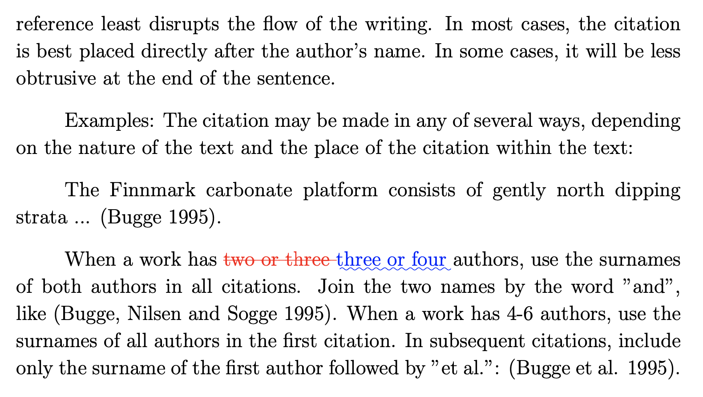

## TeX

<!-- MarkdownTOC -->

- [Manually add new package](#manually-add-new-package)
- [latexdiff](#latexdiff)

<!-- /MarkdownTOC -->

### Manually add new package

Let's say you have `duomasterforside.sty` and you want to make it available in all your documents. Just in case, check if it is already in the system:

``` sh
$ kpsewhich duomasterforside.sty
```

If that returns nothing, then you need to add it to your TDS (*TeX Directory Structure*). Find TeX home directory:

``` sh
$ kpsewhich -var-value=TEXMFHOME
```

Though keep in mind that it might give you a wrong path (*or rather a symlinked one*). If anything, on Mac OS the right one is `/usr/local/texlive/texmf-local/tex/latex/local`.

Just copy a folder with your package/styles/etc there and re-hash the database:

``` sh
$ sudo texhash
texhash: Updating /usr/local/texlive/2020/texmf-config/ls-R...
texhash: Updating /usr/local/texlive/2020/texmf-dist/ls-R...
texhash: Updating /usr/local/texlive/2020/texmf-var/ls-R...
texhash: Updating /usr/local/texlive/texmf-local/ls-R...
texhash: Done.
```

Now the package should be available:

``` sh
$ kpsewhich duomasterforside.sty
/usr/local/texlive/texmf-local/tex/latex/local/duoforside/duomasterforside.sty
```

And you can use it in your documents:

``` tex
\usepackage{babel,duomasterforside}
```

### latexdiff

When you need show some changes for/from reviewer in your final PDF, you can use [git-latexdiff](https://ctan.org/pkg/git-latexdiff) script to visualize the `git diff` output. You likely already have it installed in your system together with the rest of your TeX distribution:

``` sh
$ git latexdiff --version
$ git latexdiff -h
```

For example, having the following (*uncommitted*) changes on top of [this revision](https://github.com/retifrav/tex-sandbox/tree/e6958a4dbb04a4127e35730ef803851a2e75ab0f):

``` patch
diff --git a/1-intro.tex b/1-intro.tex
index c997c47..96a5c27 100644
--- a/1-intro.tex
+++ b/1-intro.tex
@@ -87,7 +87,7 @@ Examples: The citation may be made in any of several ways, depending on the natu
 
 The Finnmark carbonate platform consists of gently north dipping strata ... (Bugge 1995).
 
-When a work has two or three authors, use the surnames of both authors in all citations. Join the two names by the word "and", like (Bugge, Nilsen and Sogge 1995). When a work has 4-6 authors, use the surnames of all authors in the first citation. In subsequent citations, include only the surname of the first author followed by "et al.": (Bugge et al. 1995).
+When a work has three or four authors, use the surnames of both authors in all citations. Join the two names by the word "and", like (Bugge, Nilsen and Sogge 1995). When a work has 4-6 authors, use the surnames of all authors in the first citation. In subsequent citations, include only the surname of the first author followed by "et al.": (Bugge et al. 1995).
 
 \subsubsection{Reference list}
```

you can render them to PDF like this:

``` sh
$ git latexdiff --main ./_main.tex -o ./diff.pdf HEAD --
```

here:

- `HEAD` - "old" state of the document/project, and instead of `HEAD` here can be a specific commit hash;
- `--` - "new" state of the document/project, `--` means current working directory, but it can be also a specific commit hash.

And the result will be:



If you get errors about files not found, such as images, then check if you have them or their extensions blacklisted in `.gitignore`; same goes for failing bibliography - `*.bbl` files need to be tracked.

If you still get errors about missing files, check if they are untracked, and if they are, than just staging them should resolve the problem. That is probably an error of some sort within the `git-latexdiff` script.

One other thing you can try is running `git-latexdiff` with either `--whole-tree` or (*/and?*) `--latexdiff-flatten`, or try a different engine/backend, such as `--latexmk`.
