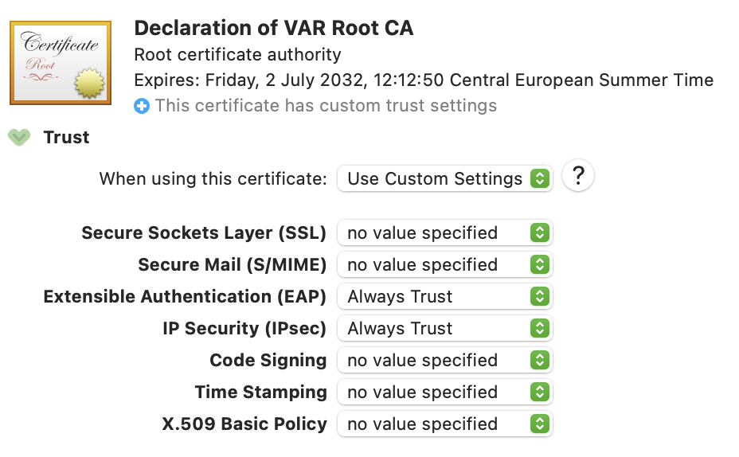
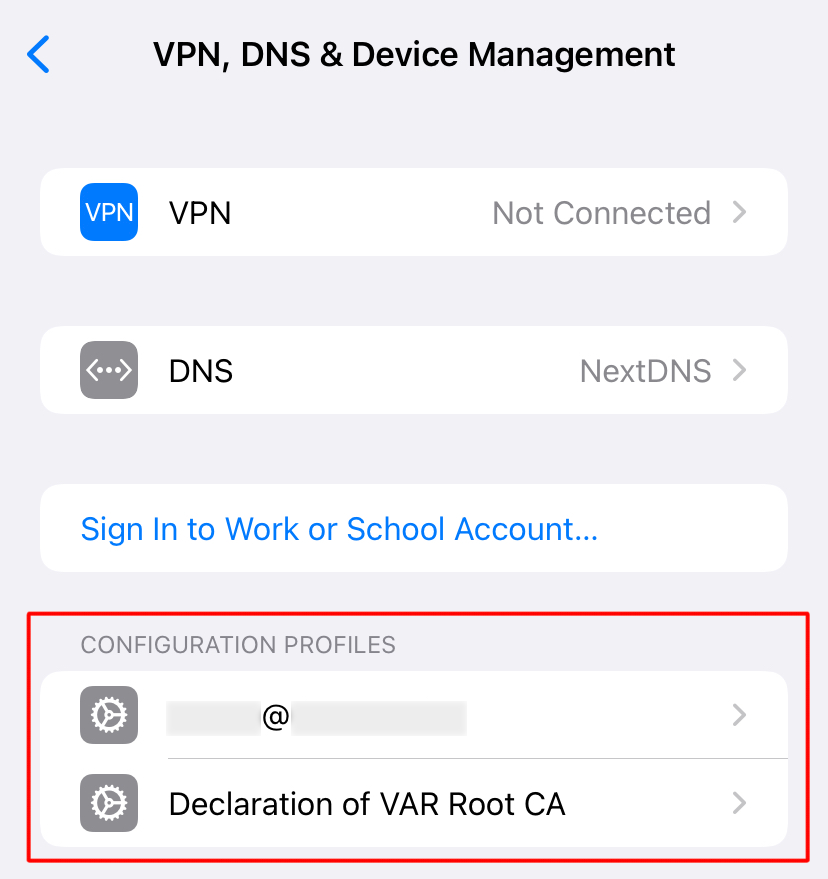
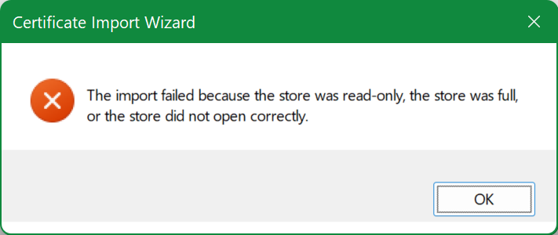
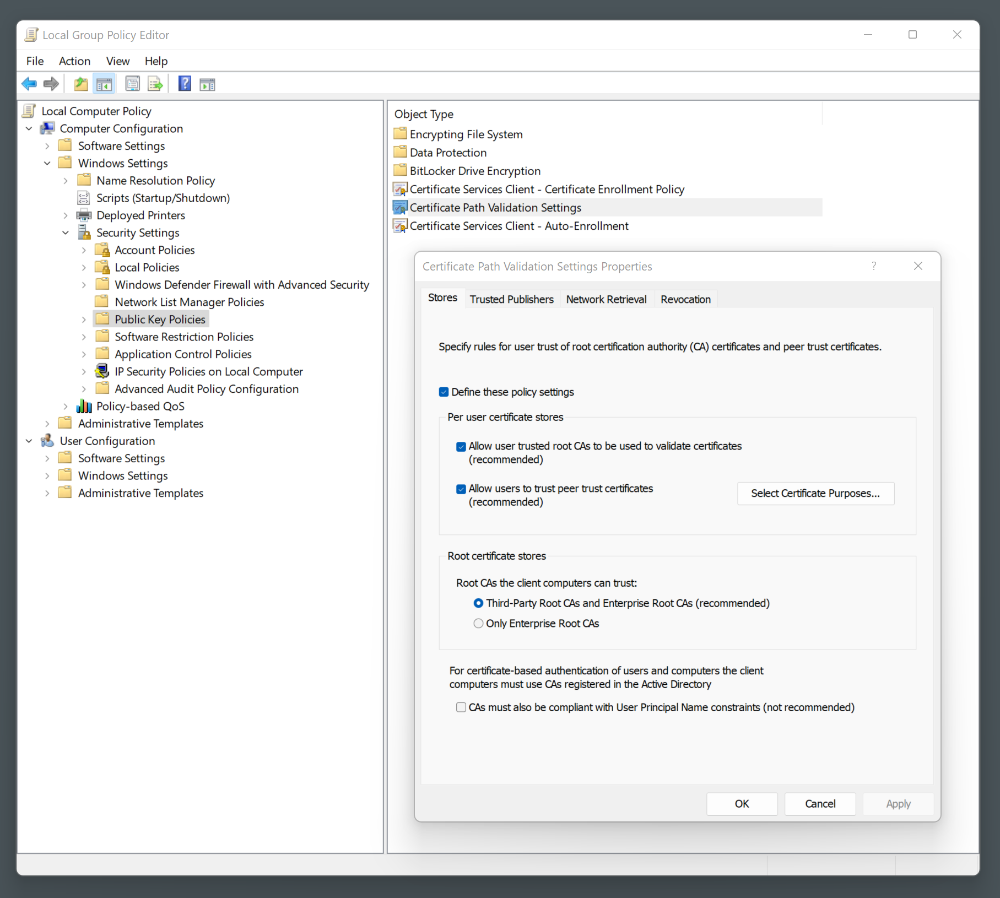
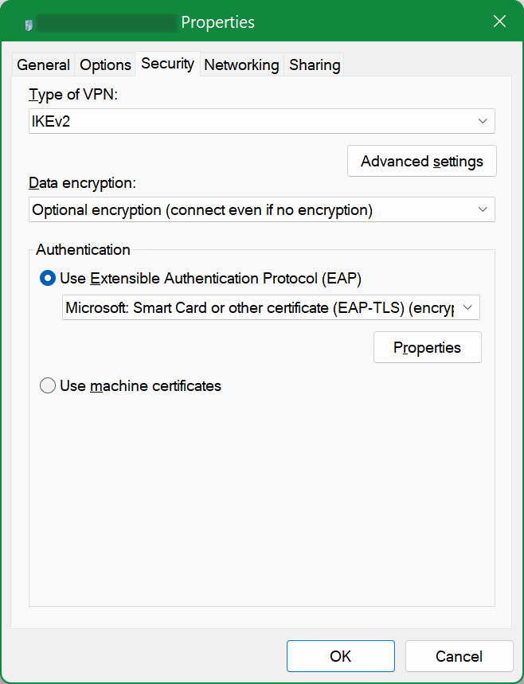

## IKEv2 VPN server with StrongSwan, v2

Original: <https://gist.github.com/envieid0c/329a0dc328acfce47fd2349710a16430>

This guide takes first steps (*stuff before certificate-related parts*) from the [base guide](./macos-ios-username-password.md). What's different about certificates is that here it makes a setup
for a certificate-based authentication (*to be precise, [X.509 User Certificate](https://docs.strongswan.org/docs/5.9/interop/windowsClients.html#_using_x_509_user_certificates)*), which works on Mac OS, iOS and Windows.

<!-- MarkdownTOC -->

- [Certificates](#certificates)
    - [Server certificates and Certificate Authority](#server-certificates-and-certificate-authority)
    - [User certificates](#user-certificates)
    - [Deploying](#deploying)
- [Configuring StrongSwan](#configuring-strongswan)
- [Setting-up clients](#setting-up-clients)
    - [Mac OS](#mac-os)
    - [iOS](#ios)
    - [Windows](#windows)
        - [The import failed because the store was read-only](#the-import-failed-because-the-store-was-read-only)
        - [The parameter is incorrect](#the-parameter-is-incorrect)
        - [Optional security parameter](#optional-security-parameter)
        - [Switching to machine certificate in VPN adapter properties](#switching-to-machine-certificate-in-vpn-adapter-properties)

<!-- /MarkdownTOC -->

### Certificates

#### Server certificates and Certificate Authority

Create a few directories to store all the assets we'll be working on. The directory structure matches some of the directories in `/etc/ipsec.d`, where we will eventually move all of the items we create:

``` sh
$ mkdir -p ~/pki/{cacerts,certs,private}
```

Then lock down the permissions so that our private files can't be seen by other users:

``` sh
$ chmod 700 ~/pki
```

Define some variables to make sure that the common re-used values are consistent:

``` sh
COUNTRY_CODE=RU
ORGANISATION="Declaration of VAR"
SERVER_NAME=some.vpn.your-domain.com
```

Create self-signed Certificate Authority (CA):

``` sh
$ pki --gen --type rsa --size 4096 --outform der > ./private/strongswan.der
$ chmod 600 ./private/strongswan.der

$ pki --self --ca --lifetime 3650 --in ./private/strongswan.der --type rsa --dn "C=$COUNTRY_CODE, O=$ORGANISATION, CN=$ORGANISATION Root CA" --outform der > ./cacerts/strongswan.der
$ openssl x509 -inform DER -in ./cacerts/strongswan.der -out ./cacerts/strongswan.pem -outform PEM

$ pki --print --in ./cacerts/strongswan.der
```

Create host key:

``` sh
$ pki --gen --type rsa --size 4096 --outform der > ./private/host-vpn.der
$ chmod 600 ./private/host-vpn.der

$ pki --pub --in ./private/host-vpn.der --type rsa | pki --issue --lifetime 730 --cacert ./cacerts/strongswan.der --cakey ./private/strongswan.der --dn "C=$COUNTRY_CODE, O=$ORGANISATION, CN=$SERVER_NAME" --san=$SERVER_NAME --flag serverAuth --flag ikeIntermediate --outform der > ./certs/host-vpn.der

$ pki --print --in ./certs/host-vpn.der
```

#### User certificates

Define some variables to make sure that the common re-used values are consistent:

``` sh
NAME="Some User"
USERNAME=someuser
USERID=someuser@your-domain.com
COUNTRY_CODE=RU
ORGANISATION="Declaration of VAR"
```

Make the keys and certificates:

``` sh
$ pki --gen --type rsa --size 2048 --outform der > ./private/$USERNAME.der
$ chmod 600 ./private/$USERNAME.der

$ pki --pub --in ./private/$USERNAME.der --type rsa | pki --issue --lifetime 730 --cacert ./cacerts/strongswan.der --cakey ./private/strongswan.der --dn "C=$COUNTRY_CODE, O=$ORGANISATION, CN=$USERID" --san "$USERID" --outform der > ./certs/$USERNAME.der
$ openssl rsa -inform DER -in ./private/$USERNAME.der -out ./private/$USERNAME.pem -outform PEM
$ openssl x509 -inform DER -in ./certs/$USERNAME.der -out ./certs/$USERNAME.pem -outform PEM

$ mkdir p12
$ openssl pkcs12 -export -inkey ./private/$USERNAME.pem -in ./certs/$USERNAME.pem -name "$NAME's VPN Certificate" -certfile ./cacerts/strongswan.pem -caname "$ORGANISATION Root CA" -out ./p12/$USERNAME.p12
```

The `./p12/$USERNAME.p12` file contains the user's private key and certificate.

#### Deploying

Now that we've generated all of the certificates, we can move the files into their place in the `/etc/ipsec.d`:

``` sh
$ sudo cp -r ~/pki/* /etc/ipsec.d/
```

### Configuring StrongSwan

``` sh
$ sudo nano /etc/ipsec.conf
```
``` conf
config setup
    charondebug="ike 1, knl 1, cfg 0"
    uniqueids=no

conn ikev2-vpn
    auto=add
    compress=no
    type=tunnel
    keyexchange=ikev2
    fragmentation=yes
    forceencaps=yes
    dpdaction=clear
    dpddelay=300s
    rekey=no
    left=%any
    leftid=@some.vpn.your-domain.com
    leftcert=host-vpn.der
    leftsendcert=always
    leftsubnet=0.0.0.0/0
    right=%any
    rightid=%any
    rightauth=eap-tls
    rightsourceip=10.10.10.0/24
    rightdns=8.8.8.8,8.8.4.4
    rightsendcert=never
    eap_identity=%identity
    ike=aes128-sha1-modp1024,aes128-sha1-modp1536,aes128-sha1-modp2048,aes128-sha256-ecp256,aes128-sha256-modp1024,aes128-sha256-modp1536,aes128-sha256-modp2048,aes256-aes128-sha256-sha1-modp2048-modp4096-modp1024,aes256-sha1-modp1024,aes256-sha256-modp1024,aes256-sha256-modp1536,aes256-sha256-modp2048,aes256-sha256-modp4096,aes256-sha384-ecp384,aes256-sha384-modp1024,aes256-sha384-modp1536,aes256-sha384-modp2048,aes256-sha384-modp4096,aes256gcm16-aes256gcm12-aes128gcm16-aes128gcm12-sha256-sha1-modp2048-modp4096-modp1024,3des-sha1-modp1024!
    esp=aes128-aes256-sha1-sha256-modp2048-modp4096-modp1024,aes128-sha1,aes128-sha1-modp1024,aes128-sha1-modp1536,aes128-sha1-modp2048,aes128-sha256,aes128-sha256-ecp256,aes128-sha256-modp1024,aes128-sha256-modp1536,aes128-sha256-modp2048,aes128gcm12-aes128gcm16-aes256gcm12-aes256gcm16-modp2048-modp4096-modp1024,aes128gcm16,aes128gcm16-ecp256,aes256-sha1,aes256-sha256,aes256-sha256-modp1024,aes256-sha256-modp1536,aes256-sha256-modp2048,aes256-sha256-modp4096,aes256-sha384,aes256-sha384-ecp384,aes256-sha384-modp1024,aes256-sha384-modp1536,aes256-sha384-modp2048,aes256-sha384-modp4096,aes256gcm16,aes256gcm16-ecp384,3des-sha1!
```

Unlike the base guide, here `rightauth` is set to `eap-tls` (*and also `ike` and `esp` are heavily extended, although might be redundant*), otherwise at least Windows client was failing to connect.

Now secrets:

``` sh
$ sudo nano /etc/ipsec.secrets
```
``` conf
: RSA "host-vpn.der"
YOUR-USERNAME : EAP "YOUR-PASSWORD"
```

Providing username and password might be redundant, but do make sure that `RSA` value is set to the key you've created earlier (*the one in `/etc/ipsec.d/private/host-vpn.der`*).

And restart the service:

``` sh
$ sudo systemctl restart strongswan-starter.service
```

### Setting-up clients

Every client first of all needs these two files:

- `YOUR-USERNAME.p12`
- `strongswan.pem`

You can download them with `sftp`:

``` sh
$ sftp root@some.vpn.your-domain.com:/etc/ipsec.d/p12/YOUR-USERNAME.p12 ~/Downloads/
$ sftp root@some.vpn.your-domain.com:/etc/ipsec.d/cacerts/strongswan.pem ~/Downloads/
```

For iOS you can download them on computer first and then upload to Files application.

#### Mac OS

Double-click on the `.p12` file and add it to **Keychain Access**. Some guides say to put it into `System` keychain, but that's actually not required, plus you'll need to enter admin password every time you'd like to connect to VPN, so just add it to your `login` keychain. Enter the export password you've set on generating this key.

Double-click on the newly imported "$ORGANISATION Root CA" certificate and set `Always Trust` to `Extensible Authentication (EAP)` and `IP Security (IPsec)`:



I am not sure if you also need to double-click and add the `.pem` file, as for me it seemed to be picked up automatically when importing the `.p12` key.

Go to **System Preferences** → **Network**, add new VPN service with a name of your choice and the type set to `IKEv2`.

`Server Address` and `Remote ID` should be set to the FQDN (*`SERVER_NAME`*) of your VPN server and `Local ID` should be set to the user e-mail that you used in the process of generating the `.p12` key (*`USERID`*).

Click on `Authentication Settings`, select `Certificate` and set the certificate matching the `Local ID`.

#### iOS

Open the `.p12` file from Files. Then go to **Settings** → **General** → **VPN, DNS & Device Management**, install and trust the configuration profile (*enter the export password you've set on generating this key*). Then open the `.pem` file from Files and do the same. As a result, you should have the following:



Now go to **Settings** → **General** → **VPN** and tap **Add VPN Configuration...**. The `Type` should be `IKEv2` and the `Description` can be whatever.

`Server Address` and `Remote ID` should be set to the FQDN (*`SERVER_NAME`*) of your VPN server and `Local ID` should be set to the user e-mail that you used in the process of generating the `.p12` key (*`USERID`*).

In `Authentication` set `Certificate` and select the certificate matching the `Local ID`.

#### Windows

Double-click the `.p12` file, `Store Location` should be `Current User`, leave everything with its default values, enter the export password you've set on generating this key. Leave it at `Automatically select the certificate store...` and finish importing.

You might notice that you've got both the **Personal** and the **Trusted Root Certification Authorities** certificates, and you might think that you are all set and can proceed with creating the VPN connection. It might be so, if you're working under Administrator account (*which you shouldn't*), but most likely you are not, and so your connection will fail with authentication error - because you really do need to explicitly import the `.pem` certificate too, as it should go to `Local Machine` storage.

Open the **Manage computer certificates**, right-click on **Trusted Root Certification Authorities**, select `All Tasks` → `Import...`. The `Store Location` should be `Local Machine`. Browse for the `.pem` file and try to import it. 

Once the key and certificate are imported, you can create a VPN connection. On Windows 10/11 it's in **Settings** → **Network & internet** → **VPN**. Click `Add VPN`, set `Server name or address` to the FQDN (*`SERVER_NAME`*) of your VPN server, the `VPN type` is `IKEv2` and `Type of sign-in info` is `Certificate`.

##### The import failed because the store was read-only

If importing the `.pem` certificate fails with this error:



then you can try to set the following options in `gpedit.msc`:



And try again. But most likely the import will still fail after that. So you need to log-in to system as Administrator and do the import there - then it should succeed. After that log-off as Administrator and log-in back to your regular account.

##### The parameter is incorrect

If you get this error on trying to connect, open **Device Manager**, expand **Network Adapters** node, uninstall `WAN Miniport` drivers and not just `IKEv2` but also `IP`, `IPv6` and others. Then click `Action` → `Scan for hardware changes`, and the adapters you just uninstalled should come back, and you should be now able to connect to VPN without this error.

##### Optional security parameter

According to <https://docs.strongswan.org/docs/5.9/interop/windowsClients.html>, you might need/want to add new DWORD 32-bit value `2` in `regedit` to this node:

```
HKEY_LOCAL_MACHINE\SYSTEM\CurrentControlSet\Services\RasMan\Parameters\NegotiateDH2048_AES256
```

I did that on Windows 11 machine and on Windows 10 machine I did not do that. Both work fine, but I guess the connection on the latter is somewhat less secure.

##### Switching to machine certificate in VPN adapter properties

Some guides say that you need to go to **Network Connections** → **VPN adapter** → **Properties** → **Security** and change `Authentication` to `Use machine certificates`, but with this type of [authentication](https://docs.strongswan.org/docs/5.9/interop/windowsClients.html#_authentication_methods) (*X.509 User Certificate*) the default settings are already correct:



And for other types of authentication, such as [X.509 Machine Certificate](https://docs.strongswan.org/docs/5.9/interop/windowsClients.html#_using_x_509_machine_certificates), you would indeed need to change that setting.
