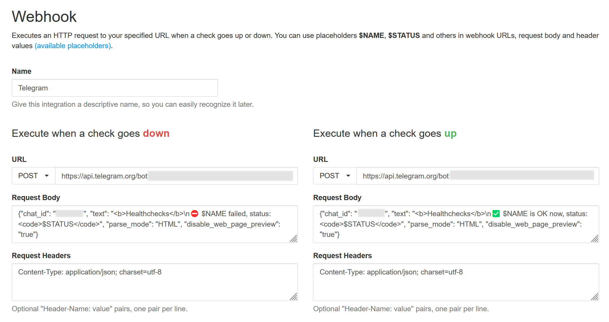
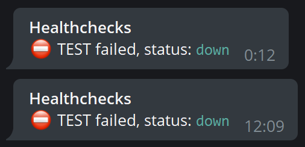
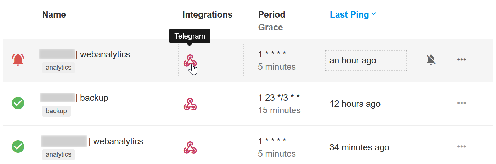

## Healthchecks

Based on rather short [official documentation](https://healthchecks.io/docs/self_hosted/).

<!-- MarkdownTOC -->

- [Preparation](#preparation)
- [Python](#python)
- [Healthchecks](#healthchecks)
    - [Running](#running)
        - [runserver](#runserver)
        - [uWSGI](#uwsgi)
    - [Alerts](#alerts)
- [NGINX](#nginx)

<!-- /MarkdownTOC -->

### Preparation

Usual [new GNU/Linux server](https://github.com/retifrav/scraps/blob/master/_linux/new-linux-server.md) routine (*including NGINX installation*).

### Python

``` sh
$ sudo apt install python3 python3-pip
$ sudo ln -s /usr/bin/python3 /usr/local/bin/python

$ python --version
Python 3.8.10

$ pip --version
pip 20.0.2 from /usr/lib/python3/dist-packages/pip (python 3.8)
```

### Healthchecks

``` sh
$ sudo -u www-data mkdir -p /var/www/healthchecks && cd $_ && cd ..
$ sudo -u www-data git clone --depth 1 --branch v1.25.0 https://github.com/healthchecks/healthchecks.git ./healthchecks
$ cd ./healthchecks/
$ git status -sb
$ git describe --tags

$ sudo pip install wheel

$ sudo -u www-data nano ./requirements.txt
remove psycopg2==2.9.1, as it will be SQLite anyway

$ pip install -r ./requirements.txt
```

You'll get these:

```
WARNING: The script sqlformat is installed in '/home/YOUR-USERNAME/.local/bin' which is not on PATH.
Consider adding this directory to PATH or, if you prefer to suppress this warning, use --no-warn-script-location.
WARNING: The script django-admin is installed in '/home/YOUR-USERNAME/.local/bin' which is not on PATH.
Consider adding this directory to PATH or, if you prefer to suppress this warning, use --no-warn-script-location.
WARNING: The script normalizer is installed in '/home/YOUR-USERNAME/.local/bin' which is not on PATH.
Consider adding this directory to PATH or, if you prefer to suppress this warning, use --no-warn-script-location.
WARNING: The script segno is installed in '/home/YOUR-USERNAME/.local/bin' which is not on PATH.
Consider adding this directory to PATH or, if you prefer to suppress this warning, use --no-warn-script-location.
```

Either add `/home/YOUR-USERNAME/.local/bin` to `PATH` or use `venv` (*there will be instructions below*), or reinstall everything with `sudo`. Once you do either of these, configure the service:

``` sh
$ sudo -u www-data nano ./healthchecks/hc/settings.py
```
``` py
DEBUG = envbool("DEBUG", "False")
# if you won't set these, it will fail with 500 when DEBUG is False
SECRET_KEY = os.getenv("SECRET_KEY", "SOME-RANDOM-SECRET-KEY")
ALLOWED_HOSTS = os.getenv("ALLOWED_HOSTS", "healthchecks.YOUR.HOST").split(",")
# ...
REGISTRATION_OPEN = envbool("REGISTRATION_OPEN", "False")
# ...
SITE_ROOT = os.getenv("SITE_ROOT", "http://healthchecks.YOUR.HOST")
SITE_NAME = os.getenv("SITE_NAME", "Healthchecks")
PING_EMAIL_DOMAIN = os.getenv("PING_EMAIL_DOMAIN", "healthchecks.YOUR.HOST")
# ...
# you might want to comment this out after everything is set-up and working fine
LOGGING = {
    'version': 1,
    'disable_existing_loggers': False,
    'formatters': {
        'verbose': {
            'format' : "[%(asctime)s] %(levelname)s [%(name)s:%(lineno)s] %(message)s",
            'datefmt' : "%d/%b/%Y %H:%M:%S"
        },
        'simple': {
            'format': '%(levelname)s %(message)s'
        },
    },
    'handlers': {
        'file': {
            'level': 'DEBUG',
            'class': 'logging.FileHandler',
            'filename': 'healthchecks.log',
            'formatter': 'verbose'
        },
    },
    'loggers': {
        'django': {
            'handlers':['file'],
            'propagate': True,
            'level':'DEBUG',
        },
        'MYAPP': {
            'handlers': ['file'],
            'level': 'DEBUG',
        },
    }
}
```

``` sh
$ sudo chown -R www-data:www-data /var/www
$ cd /var/www/healthchecks/
$ sudo -u www-data ./manage.py migrate
$ sudo -u www-data ./manage.py createsuperuser
$ sudo -u www-data mkdir /var/www/healthchecks/static-collected
$ sudo -u www-data ./manage.py compress
$ sudo -u www-data ./manage.py collectstatic
$ sudo -u www-data ./manage.py test
```

If tests fail with `403 != 200`, that's alright.

If it complains about missing `django` or whatever, `pip install django` won't help (*in fact, you already have installed it*), then you need to either add `/home/YOUR-USERNAME/.local/bin` to `PATH`, re-install the stuff from `requirements.txt` with `sudo` or create `venv`:

``` sh
$ cd /var/www/healthchecks/
$ sudo apt install python3-venv
$ sudo -u www-data python -m venv venv
$ source ./venv/bin/activate
```

and then repeat `manage.py` commands.

#### Running

One way to run the service is via [runserver](#runserver), but it's better to use [uWSGI](#uWSGI) instead.

##### runserver

``` sh
$ cd /var/www/healthchecks/
$ sudo -u www-data ./manage.py runserver
```

This one binds to `http://localhost:8000`, so set `proxy_pass` in NGINX.

Create systemd service:

``` sh
$ sudo nano /etc/systemd/system/healthchecks-runserver.service
```
``` ini
[Unit]
Description=Healthchecks

[Service]
WorkingDirectory=/var/www/healthchecks/
ExecStart=./manage.py runserver
Restart=always
RestartSec=10
SyslogIdentifier=healthchecks
User=www-data

[Install]
WantedBy=multi-user.target
```
``` sh
$ sudo systemctl enable healthchecks-runserver.service
$ sudo systemctl start healthchecks-runserver.service
```

##### uWSGI

This is supposed to be better than [runserver](#runserver):

``` sh
$ sudo pip install uwsgi

$ cd /var/www/healthchecks/
$ sudo -u www-data nano ./wsgi.ini
```
``` ini
[uwsgi]
module = hc.wsgi:application

master = true
processes = 5
threads = 10

socket = wsgi.sock
chmod-socket = 664

vacuum = true
die-on-term = true
```

``` sh
$ sudo nano /etc/systemd/system/healthchecks-uwsgi.service
```
``` ini
[Unit]
Description=Healthchecks

[Service]
WorkingDirectory=/var/www/healthchecks/
ExecStart=/usr/local/bin/uwsgi --ini ./wsgi.ini --need-app
Restart=always
RestartSec=10
SyslogIdentifier=healthchecks
User=www-data

[Install]
WantedBy=multi-user.target
```
``` sh
$ sudo systemctl enable healthchecks-uwsgi.service
$ sudo systemctl start healthchecks-uwsgi.service
```

If uWSGI complains about:

```
!!! no internal routing support, rebuild with pcre support !!!
```

then:

``` sh
$ sudo apt install libpcre3 libpcre3-dev
$ sudo pip install uwsgi -I --no-cache-dir
```

It re-installs (`-I`) and ignores the compiled cache (`--no-cache-dir`), so it's re-compiled this time with the required libraries.

#### Alerts

There are several notification options, including webhooks and even a dedicated Telegram option - this one [registers a webhook](https://github.com/healthchecks/healthchecks/issues/115) and uses a Telegram bot backend service behind the scenes, so you might prefer a [regular webhook](https://github.com/healthchecks/healthchecks/issues/618):



But when you'll set it up and even successfully test it:



it might still not send automatic alerts, even though it is enabled:



That is because aside from the service itself, you also need to run the `./manage.py sendalerts` thing. You can do it using the same uWSGI config via `attach-daemon` (*here's an [example](https://github.com/healthchecks/healthchecks/blob/master/docker/uwsgi.ini)*) or create a systemd service for it:

``` sh
$ sudo nano /etc/systemd/system/healthchecks-alerts.service
```
``` ini
[Unit]
Description=HealthchecksAlerts

[Service]
WorkingDirectory=/var/www/healthchecks/
ExecStart=/usr/bin/python ./manage.py sendalerts
Restart=always
RestartSec=10
SyslogIdentifier=healthchecks-alerts
User=www-data

[Install]
WantedBy=multi-user.target
```
``` sh
$ sudo systemctl enable healthchecks-alerts.service
$ sudo systemctl start healthchecks-alerts.service
```

### NGINX

``` sh
$ sudo apt remove --purge apache2

$ lsb_release -a
$ sudo nano /etc/apt/sources.list.d/nginx.list
```
```
deb https://nginx.org/packages/ubuntu/ focal nginx
deb-src https://nginx.org/packages/ubuntu/ focal nginx
```

``` sh
$ sudo apt update
$ sudo apt-key adv --keyserver keyserver.ubuntu.com --recv-keys ABF5BD827BD9BF62
$ sudo apt update
$ sudo apt install nginx

$ nginx -version
nginx version: nginx/1.20.2

$ sudo nano /etc/nginx/conf.d/default.conf
```
```
server {
    listen 80;
    listen [::]:80;

    server_name  healthchecks.YOUR.HOST;

    root   /var/www/healthchecks;
    index  index.html index.htm;

    location / {
        include uwsgi_params;
        uwsgi_pass unix:/var/www/healthchecks/wsgi.sock;
    }
}
```
``` sh
$ sudo systemctl start nginx.service
$ sudo systemctl status nginx.service
```

If you get:

```
2022/03/09 20:50:17 [error] 5299#5299: *1195 connect() failed (111: Connection refused) while connecting to upstream, client: 1.2.3.4, server: healthchecks.YOUR.HOST, request: "GET /projects/a7b3f709-2ca4-4226-a00d-233c47f6bd4f/checks/ HTTP/1.1", upstream: "http://127.0.0.1:8000/projects/a7b3f709-2ca4-4226-a00d-233c47f6bd4f/checks/", host: "healthchecks.YOUR.HOST", referrer: "http://healthchecks.YOUR.HOST/checks/39008590-b2a2-43ed-8138-a23a3904c0bb/details/"
```

then you could've set proxy pass in NGINX to `http://127.0.0.1:8000`, make it `unix:` and restart NGINX.

If you get:

```
2022/03/09 20:57:52 [crit] 10233#10233: *3 connect() to unix:/var/www/healthchecks/wsgi.sock failed (13: Permission denied) while connecting to upstream, client: 1.2.3.4, server: healthchecks.YOUR.HOST, request: "GET / HTTP/1.1", upstream: "uwsgi://unix:/var/www/healthchecks/wsgi.sock:", host: "healthchecks.YOUR.HOST"
```

then add `nginx` user to `www-data` group and restart NGINX:

``` sh
$ sudo usermod -a -G www-data nginx
$ sudo systemctl restart nginx.service
```
