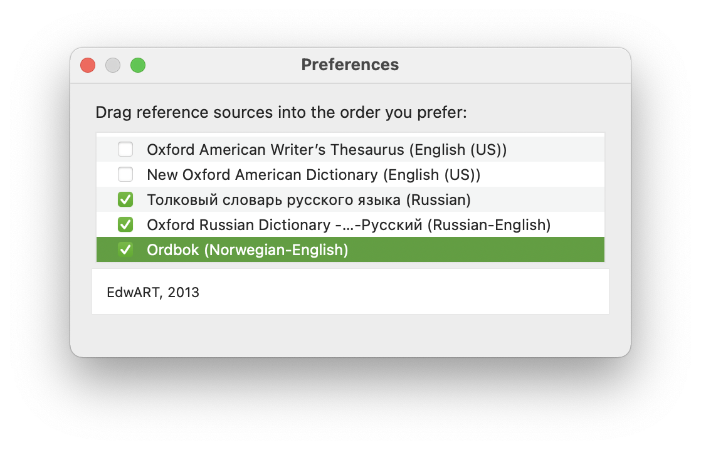
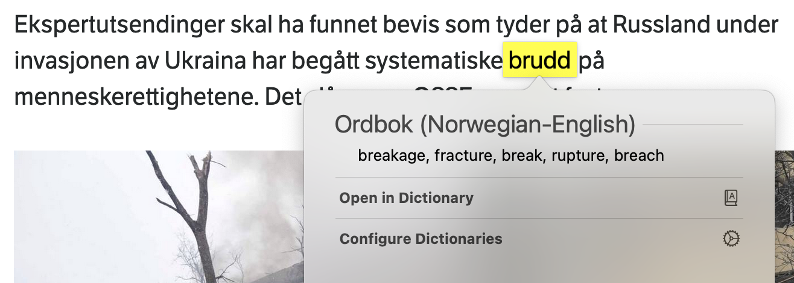

## Dictionary from DSL

<!-- MarkdownTOC -->

- [Required tools](#required-tools)
- [Converting](#converting)
    - [Either with PyGlossary](#either-with-pyglossary)
    - [Or with DSLConverter](#or-with-dslconverter)
- [Building](#building)
    - [xmllint errors](#xmllint-errors)
        - [Error in element content with nested HTML](#error-in-element-content-with-nested-html)
        - [Invalid element name with JS code](#invalid-element-name-with-js-code)
- [Installation](#installation)
- [Customizing styles](#customizing-styles)

<!-- /MarkdownTOC -->

System application `Dictionary.app` is a very lightweight and fast application, which can be extended with additional dictionaries. One way to get new dictionaries is to convert `.dsl` files into dictionary sources and build/compile them into `.dictionary` bundle.

Why not ABBYY Lingvo? Because I didn't find a fucking way to add more dictionaries to it (*despite having [official documentation](https://lingvo-support.abbyy.com/hc/en-us/articles/115005536129-Adding-a-user-dictionary-to-ABBYY-Lingvo-for-Mac)*), plus it is not as lightweight and fast as Dictionary.app.

### Required tools

- [PyGlossary](https://pypi.org/project/pyglossary/) (*or [DSLConverter](https://github.com/svintuss/DSLConverter) with [pytidylib6](https://pypi.org/project/pytidylib6/)*)
- Dictionary Development Kit from [Additional Tools for Xcode](https://developer.apple.com/download/all/?q=xcode)

### Converting

Convert `.dsl` file to Apple dictionary sources with one of the converters.

#### Either with PyGlossary

``` sh
$ pyglossary /path/to/no-en-ordbok.dsl /path/to/no-en-ordbok --read-format=ABBYYLingvoDSL --write-format=AppleDict
```

Or run just `pyglossary` and enter the paths and formats interactively.

#### Or with DSLConverter

``` sh
$ python ./dslconverter_auto.py /path/to/no-en-ordbok.dsl
```

### Building

Edit `/path/to/no-en-ordbok/Makefile` file and replace `DICT_BUILD_TOOL_DIR` value with the actual path to Dictionary Development Kit in your system, such as:

```
DICT_BUILD_TOOL_DIR = "/Applications/Utilities/Dictionary Development Kit"
```

Build/compile the `.dictionary` bundle:

``` sh
$ cd /path/to/no-en-ordbok/

$ make
"""/Applications/Utilities/Dictionary Development Kit"/bin"/build_dict.sh" -c 1 "no-en-ordbok" MyDictionary.xml MyDictionary.css MyInfo.plist
- Building no-en-ordbok.dictionary.
- Checking source.
- Cleaning objects directory.
- Preparing dictionary template.
- Preprocessing dictionary sources.
- Extracting index data.
- Preparing dictionary bundle.
- Adding body data.
- Preparing index data.
- Building key_text index.
- Building reference index.
- Fixing dictionary property.
- Copying CSS.
- Finished building ./objects/no-en-ordbok.dictionary.
echo "Done."
Done.
```

#### xmllint errors

##### Error in element content with nested HTML

If you used `DSLConverter` and now are getting errors like this on running `make`:

```
- Checking source.
MyDictionary.xml:8: parser error : internal error: detected an error in element content

    <div d:priority="2" class="title">About dictionary</div><!DOCTYPE html PUBLIC "
                                                            ^
MyDictionary.xml : failed to parse
Error.
make: *** [all] Error 1
```

Then probably you installed the wrong `pytidylib` package/library. You need exactly `pytidylib6`, as the other one for some reason adds nested HTML documents for every paragraph, which `xmllint` complains about. You can also run `xmllint` directly to verify generated dictionary `.xml` file:

``` sh
$ xmllint --stream -noout ./MyDictionary.xml
./MyDictionary.xml:8: parser error : internal error: detected an error in element content

    <div d:priority="2" class="title">About dictionary</div><!DOCTYPE html PUBLIC "
                                                            ^
./MyDictionary.xml : failed to parse
```

##### Invalid element name with JS code

If XML validation fails with this error:

``` sh
$ xmllint --stream -noout ./no-no-bokmalsordboka.xml
./no-no-bokmalsordboka.xml:4: parser error : StartTag: invalid element name
0];var opp = art.getElementsByClassName('oppsgramordklasse');for (var i = 0; i <
                                                                               ^
./no-no-bokmalsordboka.xml : failed to parse
```

Then you you need to strip/remove JS code blocks (*`<script>` tags*). With `PyGlossary` that can be done by adding `--remove-html=script` (*or even `--remove-html-all`*) parameter.

### Installation

Once `make` command succeeds, copy resulting `.dictionary` from `objects` folder to `/Users/YOUR-NAME/Library/Dictionaries/` (*or whichever opens when you click on `File` → `Open Dictionaries Folder` in Dictionary.app*). Or run `make install`.

Now restart Dictionary.app, open its Preferences and add a check mark on your dictionary:



If you want to customize the name, change `#NAME` value in the original `.dsl` file, or better yet, edit values in `/path/to/no-en-ordbok/MyInfo.plist` before running `make`:

``` xml
<?xml version="1.0" encoding="UTF-8"?>
<!DOCTYPE plist PUBLIC "-//Apple Computer//DTD PLIST 1.0//EN" "http://www.apple.com/DTDs/PropertyList-1.0.dtd">
<plist version="1.0">
<dict>
    <key>CFBundleDevelopmentRegion</key>
    <string>English</string>
    <key>CFBundleIdentifier</key>
    <string>ru.ABBYY.Lingvo.no-en-ordbok</string>
    <key>CFBundleDisplayName</key>
    <string>Ordbok (Norwegian-English)</string>
    <key>CFBundleName</key>
    <string>Ordbok (Norwegian-English)</string>
    <key>CFBundleShortVersionString</key>
    <string>1.0</string>
    <key>DCSDictionaryCopyright</key>
    <string>EdwART, 2013</string>
    <key>DCSDictionaryManufacturerName</key>
    <string>$MANUFACTURER$</string>
    <key>DCSDictionaryFrontMatterReferenceID</key>
    <string>front_back_matter</string>
</dict>
</plist>
```

### Customizing styles

If you don't like the styling of lookup popups (*`Control` + `Command` + `D` or force-touch on a word*), edit the `/Users/YOUR-NAME/Library/Dictionaries/no-en-ordbok.dictionary/Contents/DefaultStyle.css`. For example, you can set a nicer font:

``` css
html.apple_client-panel body {
    font-size: 12pt;
    font: -apple-system-body;
    font-family: -apple-system;
    margin-top: 0em;
    margin-left: 1em;
    margin-bottom: 0em;
    margin-right: 1em;
    line-height: 120%;
}
```

and perhaps also decrease margins for `div.L*` elements. In fact, you'd probably want to just copy default styles from the Dictionary.app itself: `/System/Applications/Dictionary.app/Contents/Resources/DefaultStyle.css`.

Then, after restarting that application (*not Dictionary.app*), resulting popup will look like this:



And of course it would be a better idea to set the custom style from the very beginning, so every converted `.dsl` sources would have these nice styles by default:

- in case of `PyGlossary`, pass the path to custom CSS with `--write-options=css=/path/to/custom.css`
- in case of `DSLConverter` edit the original `/path/to/DSLConverter/MyDictionary/MyDictionary.css`
