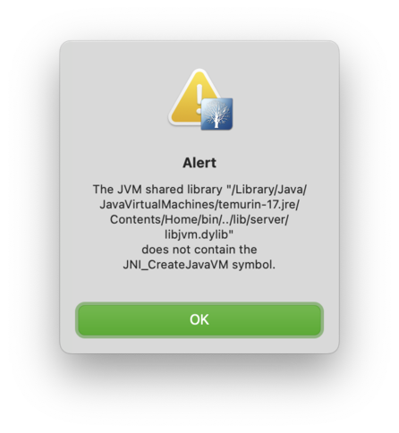

## Mac OS

<!-- MarkdownTOC -->

- [Hotkeys](#hotkeys)
- [System info](#system-info)
    - [Mac OS version](#mac-os-version)
    - [Current date and time in UTC](#current-date-and-time-in-utc)
    - [CPU](#cpu)
    - [RAM](#ram)
    - [GPU](#gpu)
    - [IP address](#ip-address)
        - [Local](#local)
        - [External](#external)
- [Pictures](#pictures)
    - [Resize pictures preserving aspect ratio](#resize-pictures-preserving-aspect-ratio)
    - [Remove EXIF metadata](#remove-exif-metadata)
- [Prevent Mac from sleeping](#prevent-mac-from-sleeping)
- [Disable Gatekeeper](#disable-gatekeeper)
- [Search](#search)
    - [Discover the biggest files](#discover-the-biggest-files)
        - [Using sort](#using-sort)
        - [Using gsort](#using-gsort)
    - [Search in your folders](#search-in-your-folders)
    - [Looking for a string in files contents](#looking-for-a-string-in-files-contents)
- [Filter out error messages](#filter-out-error-messages)
- [ZIP files](#zip-files)
    - [Pack](#pack)
    - [Unpack](#unpack)
    - [View contents](#view-contents)
- [Create a dummy file to occupy space](#create-a-dummy-file-to-occupy-space)
- [External disk images](#external-disk-images)
    - [Create an image of SD card / USB drive](#create-an-image-of-sd-card--usb-drive)
    - [Write an image to SD card / USB drive](#write-an-image-to-sd-card--usb-drive)
    - [Format SD card / USB drive](#format-sd-card--usb-drive)
        - [FAT32](#fat32)
        - [JHFSX](#jhfsx)
- [Generate PPK file from RSA](#generate-ppk-file-from-rsa)
- [Convert OXPS to PDF](#convert-oxps-to-pdf)
- [Disable System Integrity Protection](#disable-system-integrity-protection)
- [Change system sounds](#change-system-sounds)
- [Unlock files in folder](#unlock-files-in-folder)
- [Turn the screen off](#turn-the-screen-off)
- [Connect to VPN](#connect-to-vpn)
- [Wi-Fi access point](#wi-fi-access-point)
- [Startup items paths](#startup-items-paths)
- [Get disk allocation block size](#get-disk-allocation-block-size)
- [Build a C++ program](#build-a-c-program)
- [Rebuild icons cache](#rebuild-icons-cache)
- [SHA checksums](#sha-checksums)
- [Reset privacy settings for applications](#reset-privacy-settings-for-applications)
- [Spotlight](#spotlight)
    - [Rebuild index](#rebuild-index)
    - [Watch disk usage](#watch-disk-usage)
    - [Disable indexing completely](#disable-indexing-completely)
- [Encrypt a file with passwords for mutt](#encrypt-a-file-with-passwords-for-mutt)
- [Xcode](#xcode)
    - [List SDKs](#list-sdks)
    - [Record Simulator screen](#record-simulator-screen)
    - [List targets](#list-targets)
- [Query HTTPS certificate for a domain](#query-https-certificate-for-a-domain)
- [Get numerical chmod value](#get-numerical-chmod-value)
- [Split CUE](#split-cue)
- [Mac OS installer](#mac-os-installer)
    - [Download](#download)
    - [Make an ISO](#make-an-iso)
- [List pictures that have GPS data in their EXIF](#list-pictures-that-have-gps-data-in-their-exif)
- [Remove quarantine attribute for not verified developer](#remove-quarantine-attribute-for-not-verified-developer)
    - [Removing all attributes](#removing-all-attributes)
    - [Modifying attribute](#modifying-attribute)
- [Custom ringtone for iOS device](#custom-ringtone-for-ios-device)
    - [Making](#making)
    - [Transferring](#transferring)
- [Make a DMG for an application](#make-a-dmg-for-an-application)
- [Java](#java)
- [Copy files based on a list from text file](#copy-files-based-on-a-list-from-text-file)
- [Replace text in file](#replace-text-in-file)
- [Python](#python)
    - [Failed to locate symlinked Python](#failed-to-locate-symlinked-python)
- [Fix Fantastical/Calendar Office 365 events updating](#fix-fantasticalcalendar-office-365-events-updating)
- [Change from Zsh back to Bash](#change-from-zsh-back-to-bash)
- [Inspect a library](#inspect-a-library)

<!-- /MarkdownTOC -->

### Hotkeys

* ⌘ - command
* ⌥ - option
* ⌃ - control
* ⇧ - shift

Zoom parts of the screen:

* gradually zoom in:
  - ⌘ ⌥ +
* gradually zoom out:
  - ⌘ ⌥ -
* instantly zooms in to the last used scale or reset the zoom to default 100%:
  - ⌘ ⌥ 8

Minimize all windows:

* ⌘ ⌥ H M

Lock:

* ⌘ ⌃ Q

### System info

#### Mac OS version

```
$ sw_vers -productVersion
```

or

```
$ system_profiler SPSoftwareDataType
```

#### Current date and time in UTC

```
$ date '+%d.%m.%Y %H:%M:%S UTC%z'
09.03.2017 12:56:33 UTC+0100
```

#### CPU

```
$ sysctl -n machdep.cpu.brand_string
$ system_profiler SPHardwareDataType | grep Cores:
$ system_profiler SPHardwareDataType | grep Processors:
```

#### RAM

```
$ system_profiler SPHardwareDataType | grep Memory:
```

#### GPU

```
$ system_profiler SPDisplaysDataType
```

#### IP address

##### Local

```
$ ifconfig | grep "inet" | grep -Fv 127.0.0.1 | grep -Fv ::1 | awk '{print $2}'
```

or without IPv6 addresses (add space after `inet` and remove `::1` filter):

```
$ ifconfig | grep "inet " | grep -Fv 127.0.0.1 | awk '{print $2}'
```

or just:

```
$ ipconfig getifaddr en0
```

* `en0` - your network interface

##### External

```
$ curl ipecho.net/plain; echo
```

### Pictures

#### Resize pictures preserving aspect ratio

```
$ sips --resampleWidth 800 some.jpg
```

But [better install ImageMagick](https://decovar.dev/blog/2019/12/12/imagemagick-vs-sips-resize/) and resize with it, as it preserves better quality:

``` sh
$ magick convert some.jpg -resize 800 some-800.jpg
```

#### Remove EXIF metadata

Except color profile, of course:

``` sh
$ exiftool -all= --icc_profile:all ./some.jpg
```

### Prevent Mac from sleeping

```
caffeinate -u -t 600
```

* `-u` - emulates "user" usage
* `-t 600` - 600 seconds (10 minutes)

### Disable Gatekeeper

To allow installing applications from any source.

Check the status:

```
spctl --status
```

* `assessments enabled` - feature is turned on (you cannot install apps from any source)
* `assessments disabled` - feature is turned off (you can install from anywhere)

Turn off the feature:

```
sudo spctl --master-disable
```

Turn on the feature back:

```
sudo spctl --master-enable
```

### Search

#### Discover the biggest files

And the biggest directories too, of course.

##### Using sort

```
du -sh ~/* | sort -rn | head -10
```

* `du` - utility that displays the file system block usage
    * `-s` - show only top-level folders (without showing subfolders)
    * `-h` - present folders size in a human-readable format
    * `~/*` - count everything from the home directory
* `sort` - utility for sorting results
    * `-r` - reverse the list (because by default it goes ascending)
    * `-n` - sort by numeric values (size, in our case)
* `head` - shows only specified number of lines from result

However, this `sort` sorts only numbers without respecting the data unit (MB, GB, etc):

```
username@MacBook-Pro:~$ du -sh ~/* | sort -rn | head -10
880M	/Users/username/Applications
879M	/Users/username/temp
 56G	/Users/username/Library
 34M	/Users/username/Desktop
 23G	/Users/username/Pictures
 11G	/Users/username/Music
9.2G	/Users/username/Documents
```

##### Using gsort

```
du -sh ~/* | gsort -rh | head -10
```

```
username@some-MacBook-Pro:~$ du -sh ~/* | gsort -rh | head -10
 56G    /Users/username/Library
 23G    /Users/username/Pictures
 11G    /Users/username/Music
9.2G    /Users/username/Documents
6.3G    /Users/username/Movies
2.3G    /Users/username/Downloads
880M    /Users/username/Applications
879M    /Users/username/temp
```

So, it is all the same, but instead of `sort` we are using `gsort`, which supports `h` option (that respects human-readable data units). If you don't have `gsort` in your system, it can be installed via `brew install coreutils`.

#### Search in your folders

Let's find all the files (and folders) in your home folder that are related to the **GarageBand** application:

```
find ~ -iname "*garage*"
```

Two `*` wildcards will help to find any file (and folder) that contains `garage` in any part of its name.

You can also look for all `.mp4` files in your home directory:

```
find ~ -iname "*.mp4"
```

And here's a more complex example: look for all `.mp4` files in your home directory, then sort results by the file size and show only top 10 biggest ones:

```
find ~ -iname "*.mp4" -print0 | xargs -0 du -sh | gsort -rh | head -10
```

* `find` - utility for searching
    * `-iname` - look in file names, ignoring case and using `*` wildcard to specify the `.mp4` extension
    * `-print0` - adds a NULL character (instead of newline) after the name of each found file. This is needed for long file names with spaces and stuff
* `xargs` - takes result strings from the previous command and uses them as arguments for the next command in pipe (for `du` in our case)
    * `-0` - tells xargs to expect NULL characters as separators instead of spaces (that aligns with our `-print0` from `find`)
* `gsort` - read about it [here](#discover-the-biggest-files)

#### Looking for a string in files contents

Search in files of parent directory only (without going into subfolders):

```
grep -ils "sOmE tEXt" *.txt
```

* `grep` - utility for searching text
    * `-i` - ignoring case
    * `-l` - output only file names
    * `-s` - don't show warnings like `Is a directory`
    * `*.txt` - file name pattern, but works only with a single directory level (doesn't apply to subfolders)

Search in subfolders too:

```
grep -ilrn "sOmE tEXt" *
```

* `-r` - search recursively (in subfolders). Now there is no need in option `-s` (I guess)
* `-n` - add line numbers

Search in particular files only:

```
grep -ilr "sOmE tEXt" --include=*.{txt,mark*} *
```

* `--include=` - proper file name pattern that applies to all folder levels. This particular one will process only `.txt` and `.markdown` (all `.mark*` ones, to be precise) files

Another (clearer) way:

```
grep --include=\*.{cpp,h} -irn "/some/path/" -e "sOmE tEXt"
```

### Filter out error messages

Say you want to exclude error messages from some output.

If you want to exclude all the errors:

```
find / -iname "*.mp4" 2>/dev/null
```

If you want to exclude only specific errors:

```
find / -iname "*.mp4" 2>&1 | grep -v "Operation not permitted" | grep -v "Permission denied"
```

### ZIP files

#### Pack

```
$ zip -r9T archiveName.zip folderToArchive -x "*.DS_Store"
```

* `-r` - recursive, including all subfolders
* `-9` - compression level: from `0` (no compression) to `9` (maximum compression)
* `-T` - test archive integrity after finishing

#### Unpack

To unpack the archive into current folder:

```
$ unzip archiveName.zip
```

#### View contents

With `less`:

```
$ brew install lesspipe
$ nano ~/.bash_profile
export LESSOPEN="|/usr/local/bin/lesspipe.sh %s" LESS_ADVANCED_PREPROCESSOR=1
$ source ~/.bash_profile
$ less archiveName.zip
```

With `unzip`:

```
$ unzip -l archiveName.zip
```

### Create a dummy file to occupy space

```
$ dd if=/dev/random of=/tmp/stupidfile.crap bs=20m
```

This will start to create a file, "growing" it with 20 MB chunks of random trash. The process will never stop, so you'll need to break it with `⌃ + C`.

If you want to monitor the file's size in Terminal, install and run `watch` utility:

```
$ brew install watch
$ watch ls -alh /tmp/stupidfile.crap
```

### External disk images

That actually works with external USB flash drives too, and of course not only `.img` but `.iso` as well.

#### Create an image of SD card / USB drive

```
$ diskutil list
$ sudo dd if=/dev/rYOUR-CARD of=/path/to/image.img bs=1m
```

#### Write an image to SD card / USB drive

```
$ diskutil list
$ diskutil unmountDisk /dev/YOUR-CARD
$ sudo dd if=/path/to/image.img of=/dev/rYOUR-CARD bs=1m
```
* `r` - raw, makes the writing faster

You can watch the progress by pressing `⌃ + T` combination.

After it's finished, eject the drive:

```
$ diskutil eject /dev/YOUR-USB-DRIVE
```

#### Format SD card / USB drive

Available file systems:

```
$ diskutil listFilesystems
```

##### FAT32

```
$ diskutil list
$ sudo diskutil eraseDisk FAT32 CARD-LABEL MBRFormat /dev/YOUR-CARD
```

##### JHFSX

Mac OS Extended (Case-sensitive, Journaled):

```
$ sudo diskutil eraseDisk jhfsx MAC /dev/YOUR-CARD
```

Source and additional information: http://gree2.github.io/mac/command/2015/06/27/mac-diskutil-command

### Generate PPK file from RSA

So you have your RSA key to connect to some server via SFTP. But suddenly you need to connect to this server from Windows using FileZilla, and it accepts only PPK files.

```
brew install putty
puttygen ~/.ssh/id_rsa_server -o server.ppk
```

### Convert OXPS to PDF

```
brew install ghostscript
/usr/local/Cellar/ghostscript/9.26/bin/gxps -sDEVICE=pdfwrite -sOutputFile=~/Desktop/output.pdf -dNOPAUSE some-file.oxps
```

### Disable System Integrity Protection

1. Reboot the Mac and hold down `Command + R` after you hear the startup chime, this will boot macOS into Recovery Mode;
2. Click the Utilities menu at the top of the screen instead and choose Terminal;
3. `csrutil disable`;
4. Reboot the Mac.

### Change system sounds

1. Disable [System Integrity Protection](#disable-system-integrity-protection);
2. Choose the sound file you want to change (`/System/Library/Components/CoreAudio.component/Contents/SharedSupport/SystemSounds/dock/drag to trash.aif`);
3. Replace it with a sound of your choice;
4. Enable System Integrity Protection back.

### Unlock files in folder

```
chflags -R nouchg /path/to/some/folder
```

* `-R` - recursive;
* `nouchg` - removes immutable flag.

### Turn the screen off

```
pmset displaysleepnow
```

### Connect to VPN

```
sudo openconnect https://vpn.your.domain/full --user=vasya
```

### Wi-Fi access point

```
sudo networksetup -createnetworkservice Loopback lo0
sudo networksetup -setmanual Loopback 172.20.42.42 255.255.255.255
```

And then enable **Internet Sharing** for **Loopback** interface in the **Sharing** settings.

### Startup items paths

```
/Library/StartupItems
/Library/LaunchDaemons
/Library/LaunchAgents
/System/Library/LaunchAgents
/System/Library/LaunchDaemons
```

And how to disable daemons:

```
sudo launchctl unload /Library/LaunchDaemons/com.some.helper.plist
sudo rm /Library/LaunchDaemons/com.some.helper.plist
```

### Get disk allocation block size

```
$ diskutil list

/dev/disk0 (internal):
   ...

/dev/disk1 (synthesized):
   ...

/dev/disk2 (external, physical):
   #:                       TYPE NAME                    SIZE       IDENTIFIER
   0:     FDisk_partition_scheme                        *2.0 TB     disk2
   1:               Windows_NTFS Samsung_T5              2.0 TB     disk2s1

$ diskutil info disk2s1

   Device Identifier:         disk2s1
   Device Node:               /dev/disk2s1
   ...

   Volume Name:               Samsung_T5
   Mounted:                   Yes
   Mount Point:               /Volumes/Samsung_T5

   Partition Type:            Windows_NTFS
   File System Personality:   ExFAT
   Type (Bundle):             exfat
   Name (User Visible):       ExFAT

   Disk Size:                 2.0 TB (2000396321280 Bytes) (exactly 3907024065 512-Byte-Units)
   Device Block Size:         512 Bytes

   ...
   Allocation Block Size:     131072 Bytes
```

* `Device Block Size` - physical block size (sector);
* `Allocation Block Size` - logical block size: 131072 bytes is 128 KB per block (131072 B / 1024 = 128 KB), so one such block takes 256 sectors on this disk (1 sector is 512 bytes).

### Build a C++ program

```
$ nano some.cpp
```

``` cpp
#include <iostream>

int main(int argc, char *argv[])
{
    std::cout << "ololo\n";

    return 0;
}
```

```
$ clang++ some.cpp -o some
$ ./some
```

If you need C++11 standard, then:

```
clang++ -std=c++11 some.cpp -o some
```

### Rebuild icons cache

From [Clearing the Icon Services Cache in Mojave](https://mjtsai.com/blog/2019/02/01/clearing-the-icon-services-cache-in-mojave/).

As administrator:

```
sudo rm -rfv /Library/Caches/com.apple.iconservices.store
sudo find /private/var/folders/ \( -name com.apple.dock.iconcache -or -name com.apple.iconservices \) -exec rm -rfv {} \;
```

Then as your normal user:

```
killall Dock
```

### SHA checksums

By default it calculates SHA1:

```
$ shasum ./clonezilla-live-20191024-eoan-amd64.iso > clonezilla-live-20191024-eoan-amd64.iso.sha1
```

You can specify SHA256 (*or any other*):

```
$ shasum -a 256 ./clonezilla-live-20191024-eoan-amd64.iso > clonezilla-live-20191024-eoan-amd64.iso.sha256
```

To verify checksum:

```
$ shasum -c ./clonezilla-live-20191024-eoan-amd64.iso.sha256
```

### Reset privacy settings for applications

```
$ tccutil reset AppleEvents
$ tccutil reset SystemPolicyAllFiles
```

### Spotlight

#### Rebuild index

Helped me when `accountsd` was consuming more than 200% CPU and **Mail** was barely usable.

``` sh
$ cd /
$ sudo mdutil -E /
$ sudo mdutil -a -i off
$ sudo rm -fr .Spotlight-V100/
$ sudo mdutil -i on /Volumes/Macintosh\ HD
```

#### Watch disk usage

``` sh
$ sudo fs_usage -w -f filesys mds_stores
```

#### Disable indexing completely

If rebuilding index doesn't really help, and `mds` and `mds_stores` continue to eat up CPU and do something like crazy even when you don't do anything, disable it for good, fuck that thing:

``` sh
$ sudo mdutil -a -i off
```

To turn it back on:

``` sh
$ sudo mdutil -a -i on
```

### Encrypt a file with passwords for mutt

Go to temp folder:

```
$ cd /tmp
$ nano pwds
```

Enter some passwords:

```
set my_pwd_ololo = nfSas3SF#f54snCs
set my_pwd_some = cm!jj1i495sfdsgs
```

Encrypt them with PGP and move encrypted file somewhere:

``` sh
$ gpg --recipient YOUR-EMAIL-FROM-GPG-KEYCHAIN --encrypt pwds
$ rm pwds
$ mv pwds.gpg ~/.mutt
```

Now you can read decrypt and read those passwords and refer to them in your configs like this:

```
source "gpg -dq ~/.mutt/pwds.gpg |"
set imap_pass = $my_pwd_ololo
```

Your PGP tool will be asking you for master password, so save it in the system keychain.

### Xcode

#### List SDKs

``` sh
$ xcodebuild -showsdks

DriverKit SDKs:
    DriverKit 21.2                    -sdk driverkit21.2

iOS SDKs:
    iOS 15.2                          -sdk iphoneos15.2

iOS Simulator SDKs:
    Simulator - iOS 15.2              -sdk iphonesimulator15.2

macOS SDKs:
    macOS 12.1                        -sdk macosx12.1

tvOS SDKs:
    tvOS 15.2                         -sdk appletvos15.2

tvOS Simulator SDKs:
    Simulator - tvOS 15.2             -sdk appletvsimulator15.2

watchOS SDKs:
    watchOS 8.3                       -sdk watchos8.3

watchOS Simulator SDKs:
    Simulator - watchOS 8.3           -sdk watchsimulator8.3
```

#### Record Simulator screen

``` sh
$ xcrun simctl io --help
```

If you get

```
xcrun: error: unable to find utility "simctl", not a developer tool or in PATH
```

enable `Command Line Tools` in `Xcode` ➞ `Preferences` ➞ `Locations`.

To record a video start the `Simulator` and:

``` sh
$ xcrun simctl io booted recordVideo --codec=h264 capture.mp4
```

#### List targets

``` sh
$ sqlite3 /Applications/Xcode.app/Contents/Developer/Platforms/iPhoneOS.platform/usr/standalone/device_traits.db

> select * from Devices where ProductDescription like 'iPad Pro (11-inch%';
j517ap|j517|ap|t8103|iPad13,4|iPad Pro (11-inch) (3rd generation)|iPad8,2||11
j517xap|j517x|ap|t8103|iPad13,5|iPad Pro (11-inch) (3rd generation)|iPad8,2||9
j518ap|j518|ap|t8103|iPad13,6|iPad Pro (11-inch) (3rd generation)|iPad8,4||11
j518xap|j518x|ap|t8103|iPad13,7|iPad Pro (11-inch) (3rd generation)|iPad8,4||9
j317ap|j317|ap|t8027|iPad8,1|iPad Pro (11-inch)|iPad7,3||21
j418ap|j418|ap|t8027|iPad8,10|iPad Pro (11-inch) (2nd generation)|iPad8,3||2
j317xap|j317x|ap|t8027|iPad8,2|iPad Pro (11-inch)|iPad7,3||2
j318ap|j318|ap|t8027|iPad8,3|iPad Pro (11-inch)|iPad7,4||21
j318xap|j318x|ap|t8027|iPad8,4|iPad Pro (11-inch)|iPad7,4||2
j417ap|j417|ap|t8027|iPad8,9|iPad Pro (11-inch) (2nd generation)|iPad8,1||2
```

### Query HTTPS certificate for a domain

``` sh
$ openssl s_client -showcerts -connect protvshows.com:443
```

### Get numerical chmod value

``` sh
$ stat -f "%OLp" ~/.ssh/github
600
```

### Split CUE

Most of the times [XLD](https://tmkk.undo.jp/xld/index_e.html) is the tool. If it cannot open some `.cue`, then perhaps this file is in some weird encoding (*such as `Windows 1251`*) or you don't have a required decoder installed (*such as `wavpack`*).

If, still, you'd prefer using CLI tools, then [shntool](http://shnutils.freeshell.org/shntool/) is one:

``` sh
$ brew info shntool
$ brew install wavpack
```

And then:

``` sh
$ shnsplit -f some.wv.cue -o flac -t '%n - %p - %t' some.wv
```

here:

- `-f some.wv.cue` path to `.cue` file
- `-o` output format
- `-t` tracks name format (*03 - Linkin Park - Somewhere I Belong*)
- `some.wv` - path to the file to split

### Mac OS installer

#### Download

``` sh
$ softwareupdate --fetch-full-installer --full-installer-version 11.3
```

- `11.3` - Big Sur
- `10.15.7` - Catalina
- `10.14.6` - Mojave
- `10.13.6` - High Sierra

If some of those give an error like `Install failed with error: Update not found`, try to change the third number in the version value.

#### Make an ISO

``` sh
$ hdiutil create -o /tmp/MacBigSur -size 13100m -volname MacBigSur -layout SPUD -fs HFS+J
$ hdiutil attach /tmp/MacBigSur.dmg -noverify -mountpoint /Volumes/MacBigSur
$ sudo /path/to/Install\ macOS\ Big\ Sur.app/Contents/Resources/createinstallmedia --volume /Volumes/MacBigSur --nointeraction
```

If you get an error like:

```
Erasing disk: 0%... 10%...
Error erasing disk error number (22, 0)
An error occurred erasing the disk.
```

Then make sure that `/tmp` (*or whichever*) is not opened in any Terminal tab (*including your current one*) and also that it is not opened in any Finder window/tab. If that still doesn't help, then reboot the computer (*and you will likely need to recreate the image, as `/tmp` folder is usually cleared on reboot*).

The successful output should look like this:

```
Erasing disk: 0%... 10%... 20%... 30%... 100%
Copying to disk: 0%... 10%... 20%... 30%... 40%... 50%... 60%... 70%... 80%... 90%... 100%
Making disk bootable...
Install media now available at "/Volumes/Install macOS Big Sur"
```

Then after detaching/unmounting the image, if it was not already (*might even need to Force Eject*):

``` sh
$ hdiutil convert /tmp/MacBigSur.dmg -format UDTO -o /tmp/MacBigSur.cdr
$ mv /tmp/MacBigSur.cdr /tmp/MacBigSur.iso
```

### List pictures that have GPS data in their EXIF

``` sh
$ brew install exiftool
$ exiftool -if '$gpslatitude' -ext jpg -filename -gpslatitude -gpslongitude -T /path/to/folder/with/images > images-with-gps.txt
```

If you want the other way around, so get the images without GPS data, then `-if 'not $gpslatitude'`.

### Remove quarantine attribute for not verified developer

#### Removing all attributes

Check if there is quarantine attribute set:

``` sh
$ xattr ~/Applications/Some.app
com.apple.quarantine
```

Remove the attribute(s):

``` sh
$ xattr -cr ~/Applications/Some.app
```

#### Modifying attribute

If you have some `.dylib` libraries, but Mac OS refuses to load them, saying that developer cannot be verified, for example when you downloaded FFmpeg libraries for Audacity.

Check the attribute values:

``` sh
$ xattr -p com.apple.quarantine ffmpeg*.dylib
ffmpeg.55.64bit.dylib: 0083;61211dae;Keka;77B2039D-233L-4BB7-A515-5C8LM8E62352
ffmpeg_codecs.55.64bit.dylib: 0083;61211dae;Keka;77B2039D-233L-4BB7-A515-5C8LM8E62352
ffmpeg_utils.52.64bit.dylib: 0083;61211dae;Keka;77B2039D-233L-4BB7-A515-5C8LM8E62352
```

Replace `0083` with `00c1`:

``` sh
$ xattr -w com.apple.quarantine "00c1;61211dae;Keka;77B2039D-233L-4BB7-A515-5C8LM8E62352" ffmpeg*.dylib
```

### Custom ringtone for iOS device

#### Making

1. Cut the fragment of the song you want (*Audacity is a nice tool for that*). It should be less than 30 seconds
2. Convert it to M4A, for example with FFmpeg, or export it directly to M4A from your audio editor
3. Rename `your-file.m4a` to `your-file.m4r`

#### Transferring

The procedure for transferring it to your iOS device is constantly changing, thanks to Apple. On Mac OS 11.5.2 [the following](https://osxdaily.com/2020/11/20/how-to-copy-ringtone-to-iphone-from-macos-big-sur-catalina-with-finder/#comment-8751559) works:

1. Delete all the metadata from your file:
``` sh
$ exiftool -all:all= ./your-file.m4r
```
2. Just in case, there should not be spaces of weird symbols in the file name
3. Connect your iOS device to your Mac, open Finder, open discovered device
4. Drag your file anywhere in the General tab

Oh, and by the way, Apple, **fuck you**!

### Make a DMG for an application

``` sh
$ hdiutil create -volname SomeName -srcfolder /path/to/some.app -ov -format UDZO some.dmg
```

Note that a simple 7z archive of the same application will have a much better compression, and essentially it doesn't matter if your application is distributed as a DMG of as a 7z archive, so the latter is a better choice.

### Java

If you get an error about missing Java, when trying to launch some application:

```
This application requires that Java 8 or later be installed on your computer. Please download and install the latest version of Java from www.java.com and try again.
```


Then you need to install JRE. The process was never easy, and I couldn't find a way that would make all the applications happy, but what does work is to download JRE from [here](https://adoptium.net/releases.html?variant=openjdk8&jvmVariant=hotspot), install the `.pkg` and run the application via `-jar`:

``` sh
$ /usr/libexec/java_home
$ java -jar ~/Applications/TOPCAT.app/Contents/Java/topcat-full.jar
```

If trying to run an application you get:

```
The JVM shared library "/Library/Java/JavaVirtualMachines/temurin-17.jre/Contents/Home/bin/../lib/server/libjvm.dylib" does not contain the JNI_CreateJavaVM symbol
```



or similar, then it could be that you have an ARM-based Mac and you installed an aarch64-based JRE, but that application is for Intel x64. In that case you just need to install an x64-based JRE. Be aware that it will be installed instead of the previously installed aarch64-based one, which probably means that you'll be able to run either x64 applications or ARM ones (*having installed that JRE instead*).

### Copy files based on a list from text file

If you don't want to preserve folder structure, remove `-R` option:

``` sh
$ rsync -R $(<list.txt) /path/to/destination/folder || :
```

And the `|| :` on the end will make it succeed even if there are missing files.

### Replace text in file

Since `sed` on Mac OS is kind of handicapped, you need to do this `-i ""` and also you can't use `\w`:

``` sh
# /Users/build/buildAgent/work/some_git_master/install/macOS_x64/include/things/Compositing/CompositeManager.h
$ sed -i "" -E 's/.*install\/[a-zA-Z0-9_]+\///g' ./install-manifest-release.txt
# include/things/Compositing/CompositeManager.h
```

Note that `-E` is capital.

### Python

#### Failed to locate symlinked Python

So, as usual, you did that:

``` sh
$ sudo ln -s /usr/bin/python3 /usr/local/bin/python
$ which python
/usr/local/bin/python
```

But now trying to execute it fails with the following:

``` sh
$ python --version
python: error: Failed to locate 'python'.
xcode-select: Failed to locate 'python', requesting installation of command line developer tools.
```

Check where it tries to find it:

``` sh
$ xcode-select -p
/Applications/Xcode.app/Contents/Developer

$ ls -l /Applications/Xcode.app/Contents/Developer/usr/bin
```

So yeah, for some fucking reason it tries to find `python` there, and it's not there, so add it there too:

``` sh
$ sudo ln -s /Applications/Xcode.app/Contents/Developer/usr/bin/python3 /Applications/Xcode.app/Contents/Developer/usr/bin/python
$ python --version
```

If it is still pointing to Python 2, then probably your `PATH` contains some more locations that come before `/usr/local/bin`.

### Fix Fantastical/Calendar Office 365 events updating

Piece of shit of administrators in your company might disable using 3rd-party clients for your Office 365 account, so you won't be able to use Fantastical for your Office 365 calendars. There is a workaround/fallback hidden Fantastical setting: open the following URL - `x-fantastical3://defaults?key=EventKitSyncExchange&value=1&type=bool&group=1` - in web-browser and allow Fantastical to handle the action.

Here's also a comment from Fantastical's support about this setting:

> Please note it will it will be buggier and slower than it is on iOS because of how EventKit works on the Mac. Also, there are some limitations when using this option (invitees don't work, can't hide events, set custom colors, etc), but you'll be able to see the events.

But then at some point (*unrelated to this setting*) you might experience that Calendar and consequently Fantastical would stop getting updates about existing events and any new events in that particular calendar or maybe even all the calendars. The solution (*until the next time it happens*) seems to be to kill the `CalendarAgent`, forcing it to restart and re-sync:

``` sh
$ killall -9 CalendarAgent
```

I think this happens when Office 365 authentication cookie/session expires in that internet account so you need to authenticate again (*and then you also need to kill/reload the `CalendarAgent`*).

### Change from Zsh back to Bash

Under every user account (*if you have more than one*)

``` sh
$ chsh -s /bin/bash
```

and restart the terminal/session.

### Inspect a library

``` sh
$ nm --demangle ./vcpkg_installed/arm64-ios/lib/libz.a

adler32.c.o:
0000000000000330 T _adler32
0000000000000338 T _adler32_combine
00000000000003fc T _adler32_combine64
0000000000000000 T _adler32_z
0000000000000000 t ltmp0
00000000000004c0 s ltmp1
...

$ otool -hv ./vcpkg_installed/arm64-ios/lib/libz.a

Archive : ./vcpkg_installed/arm64-ios/lib/libz.a
./vcpkg_installed/arm64-ios/lib/libz.a(adler32.c.o):
Mach header
      magic  cputype cpusubtype  caps    filetype ncmds sizeofcmds      flags
MH_MAGIC_64    ARM64        ALL  0x00      OBJECT     4        360 SUBSECTIONS_VIA_SYMBOLS
...

$ lipo -info ./vcpkg_installed/arm64-ios/lib/libz.a
Non-fat file: ./vcpkg_installed/arm64-ios/lib/libz.a is architecture: arm64
```
