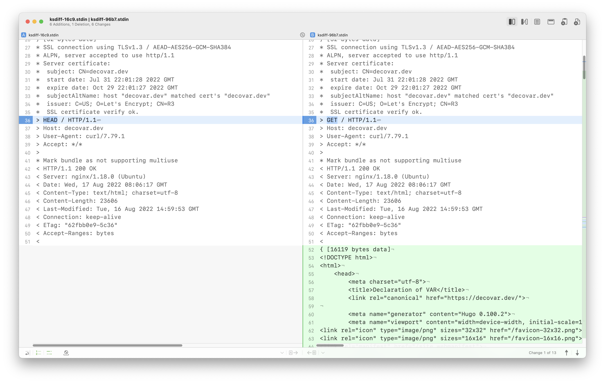

## Kaleidoscope

<!-- MarkdownTOC -->

- [Compare files](#compare-files)
- [Preview sed results](#preview-sed-results)
    - [Compare cURL outputs](#compare-curl-outputs)
- [Watch CPU usage](#watch-cpu-usage)

<!-- /MarkdownTOC -->

[ksdiff](https://blog.kaleidoscope.app/2022/04/22/ksdiff-introduction/) is a CLI tool, part of [Kaleidoscope](https://kaleidoscope.app).

### Compare files

``` sh
$ ksdiff /path/to/file1.txt /path/to/file2.txt
```

### Preview sed results

``` sh
$ cat some.txt | sed "s/some/another/g" | ksdiff some.txt -
```

#### Compare cURL outputs

Website responses to HEAD and GET requests that are sent with cURL:

``` sh
$ ksdiff <(curl -Iv https://decovar.dev 2>&1) <(curl -v https://decovar.dev 2>&1)
```

Result:



### Watch CPU usage

``` sh
$ ps -crx -o%cpu,command | grep -e "^\s.[1-9]" | ksdiff -l "ps"
```
