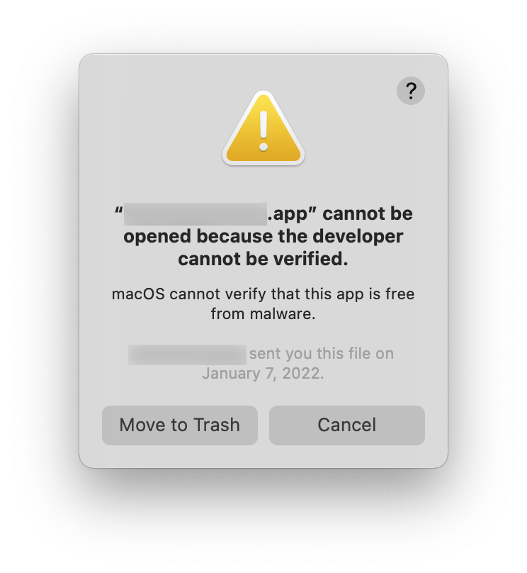
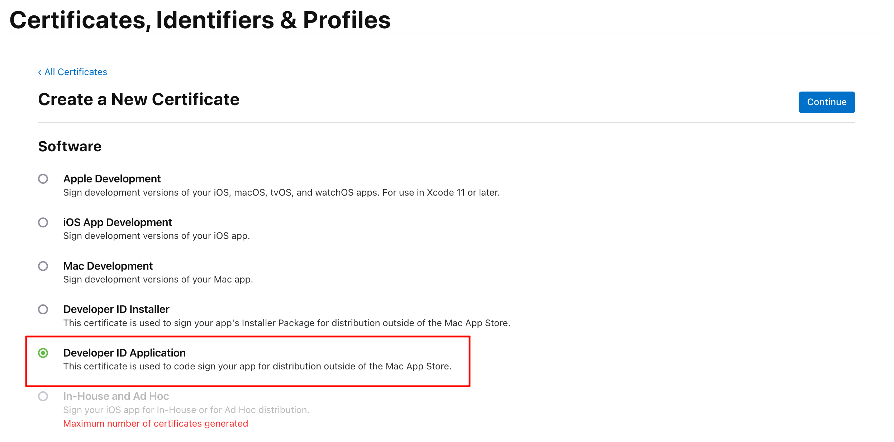
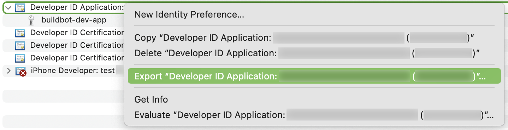
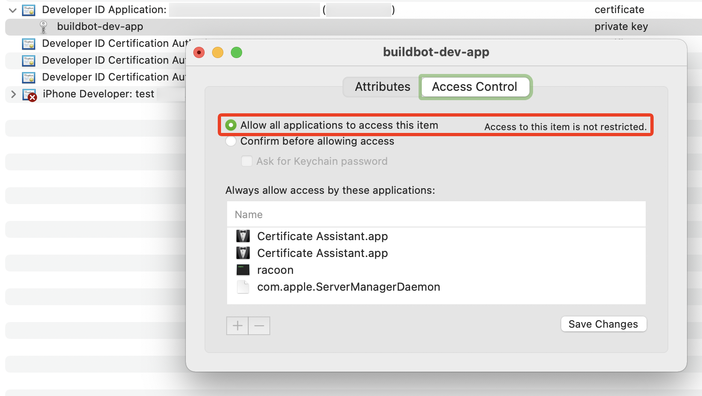
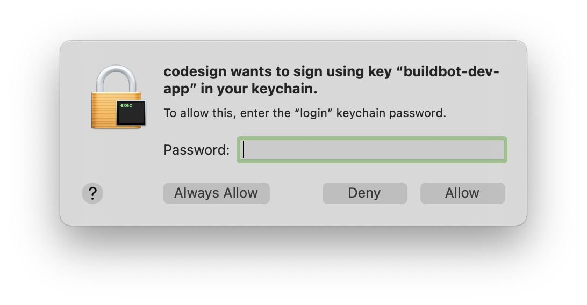
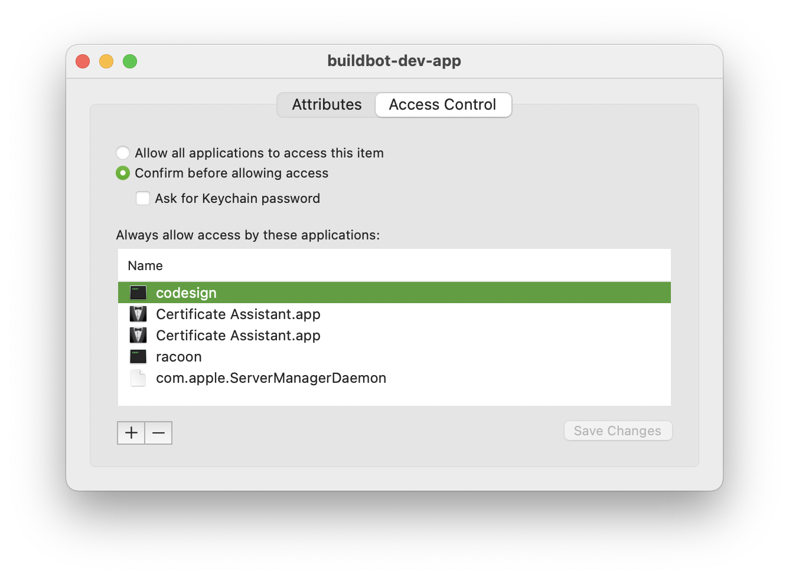
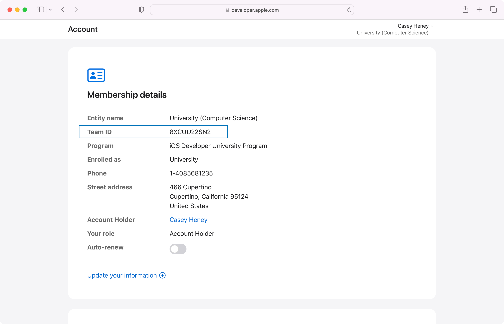
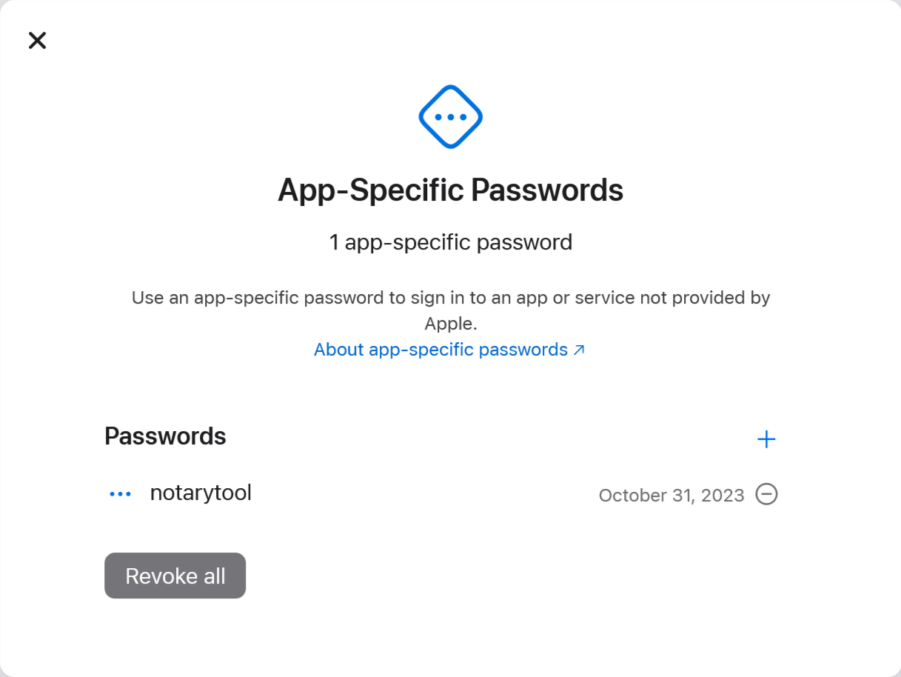
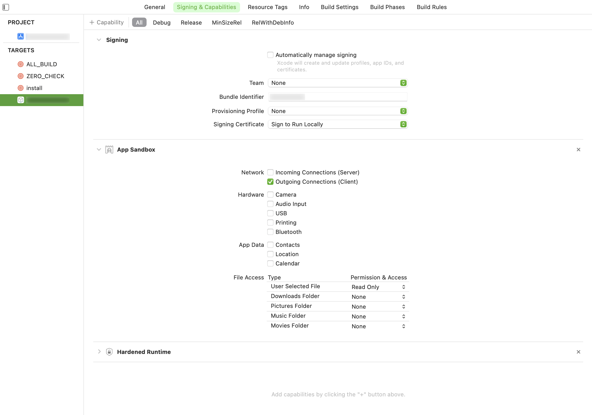

# Signing applications

<!-- MarkdownTOC -->

- [Certificate](#certificate)
- [Signing](#signing)
- [Notarizing](#notarizing)
    - [With altool](#with-altool)
    - [With notarytool](#with-notarytool)
- [Entitlements](#entitlements)

<!-- /MarkdownTOC -->

If you distribute a Mac OS application (*C++, built with CMake*) to another computer, you or rather our users will get the following error on trying to launch it:



While this can be resolved by removing quarantine attribute:

``` sh
$ xattr /path/to/Some.app
com.apple.quarantine

$ xattr -cr /path/to/Some.app
```

this is not a good UX, and instead it's better to properly [sign and notarize](https://developer.apple.com/news/?id=10032019a) the application.

## Certificate

Go to <https://developer.apple.com/account> and download the/a `Developer ID Application` certificate. If you don't have any yet, add a new one, and make sure that it is exactly of `Developer ID Application` type:



Follow Apple's instructions on how to create it, as they will be provided going on. When it's done, download and import the certificate into your system keychain (*from which you generated the certificate issuing request*).

The importing needs to be done on all your buildbots too, and since those don't have your keychain, you'll first need to export the certificate and the private key from your keychain into a `.p12` bundle (*and set a password for it, just in case*):



Once you have `.p12` bundle, you can import it on a buildbot host like so:

``` sh
$ security import ./buildbot-dev-app.p12 -P HERE-GOES-THE-PASSWORD-YOU-SET-FOR-THE-BUNDLE
```

Check that you have it available now:

``` sh
$ security find-identity -v
  1) 3R25316098208E3PE7B2372C500ADAL442E92PAC "iPhone Distribution: Your Company"
  2) G5PQECV1C0O922L3CFE4K2E3P30E2BF1233E0DDF "Developer ID Application: Your Company (V3VVLOW538)"
     2 valid identities found
```

You might have several ones here, but you'll need to use exactly the one of type `Developer ID Application`.

One more thing you need to do is to allow applications to access this key:



But despite (*or instead of?*) setting that, you might still need to log-in to the buildbot via VNC and click on `Always allow` in the GUI prompt for the very first time it will try to sign something with this certificate:



After that it should go to the list of always allowed applications, and perhaps you don't need to switch that "Allow all applications" option:



As for the actual signing and notarization, below you will find steps for performing both either manually or with a [gon](https://github.com/mitchellh/gon) tool.

In any case, especially on buildbots, you might need to unlock the keychain (*whichever you're using*), otherwise it will prompt you with GUI dialog:

``` sh
$ security -v unlock-keychain -p KEYCHAIN-PASSWORD "/Library/Keychains/System.keychain"
```

It will automatically lock back after some timeout (*300 seconds by default?*).

## Signing

The signing is done like this:

``` sh
$ codesign -s "3R25316098208E3PE7B2372C500ADAL442E92PAC" -f -v --timestamp --options runtime /path/to/install/bin/some.app

/path/to/install/bin/some.app: replacing existing signature
/path/to/install/bin/some.app: signed app bundle with Mach-O thin (x86_64) [com.your-company]
```

But note that it is important that you choose the right type of the signing certificate. Here we used a wrong certificate type (*"iPhone Distribution"*), and we'll see [later](#notarizing) how exactly that would fail.

Signing happens locally on your machine. Nothing(?) is sent to Apple yet.

Before proceeding you need to make a ZIP archive from that application bundle:

``` sh
$ cd /path/to/install/bin/
$ 7z a -tzip -mx3 -bd ./some.zip ./some.app
$ 7z t ./some.zip
```

## Notarizing

### With altool

Check that your Apple Developer account credentials are valid:

``` sh
$ xcrun altool -u "buildbot@your-company.com" -p "BUILDBOT-PASSWORD-HERE" \
    --notarization-history 0
```

If you don't get any authentication errors, then you can submit the application's ZIP archive for notarization:

``` sh
$ xcrun altool --notarize-app --primary-bundle-id com.your-company.some \
    -u "buildbot@your-company.com" -p "BUILDBOT-PASSWORD-HERE" \
    -f ./some.zip \
    --output-format xml

<?xml version="1.0" encoding="UTF-8"?>
<!DOCTYPE plist PUBLIC "-//Apple//DTD PLIST 1.0//EN" "http://www.apple.com/DTDs/PropertyList-1.0.dtd">
<plist version="1.0">
<dict>
    <key>notarization-upload</key>
    <dict>
        <key>RequestUUID</key>
        <string>4b4g5ll4-3bba-42a6-8as1-3l53fddgd54q</string>
    </dict>
    <key>os-version</key>
    <string>11.6.2</string>
    <key>success-message</key>
    <string>No errors uploading 'some.zip'.</string>
    <key>tool-path</key>
    <string>/Applications/Xcode.app/Contents/SharedFrameworks/ContentDeliveryServices.framework/Versions/A/Frameworks/AppStoreService.framework</string>
    <key>tool-version</key>
    <string>4.071.1221</string>
</dict>
</plist>
```

This will upload the archive with your application bundle to Apple. Here:

- the `--output-format` can be also `json` or `normal`;
- the `RequestUUID` is how you check the notarization status, because this operation is asynchronous.

To check the status of notarization request:

``` sh
$ xcrun altool --notarization-info 4b4g5ll4-3bba-42a6-8as1-3l53fddgd54q \
    -u "buildbot@your-company.com" -p "BUILDBOT-PASSWORD-HERE" \
    --output-format xml

<!DOCTYPE plist PUBLIC "-//Apple//DTD PLIST 1.0//EN" "http://www.apple.com/DTDs/PropertyList-1.0.dtd">
<plist version="1.0">
<dict>
    <key>notarization-info</key>
    <dict>
        <key>Date</key>
        <date>2022-01-10T10:23:29Z</date>
        <key>Hash</key>
        <string>115f871e5d43e3eb3lb7a2343lf11893l9611a33d6594ed411027d45l2c26fe4</string>
        <key>LogFileURL</key>
        <string>https://osxapps-ssl.itunes.apple.com/itunes-assets/REPORT-ID-AND-OTHER-THINGS</string>
        <key>RequestUUID</key>
        <string>4b4g5ll4-3bba-42a6-8as1-3l53fddgd54q</string>
        <key>Status</key>
        <string>invalid</string>
        <key>Status Code</key>
        <integer>2</integer>
        <key>Status Message</key>
        <string>Package Invalid</string>
    </dict>
    <key>os-version</key>
    <string>11.6.2</string>
    <key>success-message</key>
    <string>No errors getting notarization info.</string>
    <key>tool-path</key>
    <string>/Applications/Xcode.app/Contents/SharedFrameworks/ContentDeliveryServices.framework/Versions/A/Frameworks/AppStoreService.framework</string>
    <key>tool-version</key>
    <string>4.071.1221</string>
</dict>
</plist>
```

So it is invalid. More details can be found in `LogFileURL` document:

``` json
{
  "logFormatVersion": 1,
  "jobId": "4b4g5ll4-3bba-42a6-8as1-3l53fddgd54q",
  "status": "Invalid",
  "statusSummary": "Archive contains critical validation errors",
  "statusCode": 4000,
  "archiveFilename": "some.zip",
  "uploadDate": "2022-01-10T10:23:29Z",
  "sha256": "115f871e5d43e3eb3lb7a2343lf11893l9611a33d6594ed411027d45l2c26fe4",
  "ticketContents": null,
  "issues": [
    {
      "severity": "error",
      "code": null,
      "path": "some.zip/Contents/MacOS/some",
      "message": "The binary is not signed with a valid Developer ID certificate.",
      "docUrl": null,
      "architecture": "x86_64"
    }
  ]
}
```

So you do need to use the right type of certificate. Go [back](#signing) and sign again with the right one (`G5PQECV1C0O922L3CFE4K2E3P30E2BF1233E0DDF`).

Another error you can get is this one:

``` sh
*** Error: Server returned an invalid MIME type: text/html, body:
<!DOCTYPE html>
<html lang="en">
<head>
    <style>
        body {
            font-family: "Helvetica Neue", "HelveticaNeue", Helvetica, Arial, sans-serif;
            font-size: 15px;
            font-weight: 200;
            line-height: 20px;
            color: #4c4c4c;
            text-align: center;
        }

        .section {
            margin-top: 50px;
        }
    </style>
</head>
<body>
<div class="section">
    <h1>&#63743;</h1>

    <h3>Gateway Timeout</h3>
    <p>Correlation Key: LQP356U33OIGNWWGWM3HUQTSE3</p>
</div>
</body>
</html>


*** Error: Failed to get notarization info.
*** Error: Failed to get notarization info. Failed to get authorization for username 'buildbot@your-company.com' and password. (
    "Error Domain=NSCocoaErrorDomain Code=0 \"Status code: 0\" UserInfo={NSLocalizedDescription=Status code: 0, NSLocalizedFailureReason=The auth server returned a bad status code.}"
) (-1011)
 {
    NSLocalizedDescription = "Failed to get notarization info.";
    NSLocalizedFailureReason = "Failed to get authorization for username 'buildbot@your-company.com' and password. (\n    \"Error Domain=NSCocoaErrorDomain Code=0 \\\"Status code: 0\\\" UserInfo={NSLocalizedDescription=Status code: 0, NSLocalizedFailureReason=The auth server returned a bad status code.}\"\n)";
}
```

This is an internal Apple problem (*Gateway Timeout*), so just repeat your request.

Yet another(!) error you might get is:

``` sh
*** Error: Notarization failed for './some.zip'.
*** Error: Unable to upload your app for notarization. Failed to get authorization for username 'buildbot@your-company.com' and password. (
    "Error Domain=NSCocoaErrorDomain Code=0 \"Status code: 0\" UserInfo={NSLocalizedDescription=Status code: 0, NSLocalizedFailureReason=The auth server returned a bad status code.}"
) (-1011)
 {
    NSLocalizedDescription = "Unable to upload your app for notarization.";
    NSLocalizedFailureReason = "Failed to get authorization for username 'buildbot@your-company.com' and password. (\n    \"Error Domain=NSCocoaErrorDomain Code=0 \\\"Status code: 0\\\" UserInfo={NSLocalizedDescription=Status code: 0, NSLocalizedFailureReason=The auth server returned a bad status code.}\"\n)";
}
```

even though that very same request has succeeded just some minutes ago. While indeed you might have something changed in your Apple Developer account credentials or elsewhere, for me just re-running the same operation again resulted in a successful notarization. I guess, one just cannot expect a fruit company with barely any money to have reliable servers (*using which they forcibly impose on everyone who'd like to notarize their applications*).

Anyway, successful notarization result will look like this:

``` sh
No errors getting notarization info.

          Date: 2022-01-10 11:02:59 +0000
          Hash: deaf7bae75e02d35932605dafff9035ae98d78f0690c2d6f15da0e3406475f38
    LogFileURL: https://osxapps-ssl.itunes.apple.com/itunes-assets/REPORT-ID-AND-OTHER-THINGS
   RequestUUID: 0l5faf9f-5520-pfbc-82l6-8d3px73a229b
        Status: success
   Status Code: 0
Status Message: Package Approved
```

Now the application is ready for distribution. Its signature can be checked like this on the target machine:

``` sh
$ codesign -vv /path/to/some.app
/path/to/some.app: valid on disk
/path/to/some.app: satisfies its Designated Requirement

$ spctl --verbose --assess --type execute -v /path/to/some.app
/path/to/some.app: accepted
source=Notarized Developer ID
origin=Developer ID Application: Your Company (V3VVLOW538)
```

### With notarytool

From the 1st November of 2023 the [altool](#with-altool) has been deprecated, and Apple says that [notarytool](https://developer.apple.com/documentation/technotes/tn3147-migrating-to-the-latest-notarization-tool) should be used instead.

And `atool` itself should also output these warning:

``` sh
*** Warning: altool has been deprecated for notarization and starting in late 2023 will no longer be supported by the Apple notary service. You should start using notarytool to notarize your software. (-1030)
```

If you'll follow Apple's instructions for migrating to `notarytool` and will try to notarize the application's ZIP archive like this:

``` sh
$ xcrun notarytool submit --apple-id buildbot@your-company.com --password BUILDBOT-PASSWORD-HERE \
    ./some.zip --wait
```

then you will get the following error:

```
Must provide all app-specific password authentication arguments (--apple-id, --password, --team-id). You may leave '--password' unspecified on initial invocation to receive a secure prompt.
```

so it does require that you provide the `--team-id` value too. If you don't know, which one is yours, Apple has a [documentation article](https://developer.apple.com/help/account/manage-your-team/locate-your-team-id/) about that, which says to go to [this page](https://developer.apple.com/account#MembershipDetailsCard), and there you should see something like this:



Having added `--team-id`:

``` sh
$ xcrun notarytool submit --apple-id buildbot@your-company.com --team-id TEAM-ID-HERE --password BUILDBOT-PASSWORD-HERE \
    ./some.zip --wait
```

I got the following error:

``` sh
Error: HTTP status code: 401. Unable to authenticate. The application is not allowed for primary authentication. Ensure that all authentication arguments are correct.
```

Apparently, this is because `notarytool` expects an app-specific password from that Apple ID (*another alternative is App Store Connect API key, which we don't have*), not the "main" password for the account. But our `buildbot@your-company.com` Apple ID doesn't have 2FA enabled, so there is no way to create an app-specific password. In addition to that, looks like we have lost security questions for this account (*or actually never had them, thank you, Apple?*), so we won't be able to log-in to that Apple ID at all (*although Apple Developer account still lets you in without security questions*).

Fortunately, the `buildbot@your-company.com` isn't our main Apple Developer account, and we do have a proper one, which has 2FA enabled, which makes it possible to create an app-specific password:



To check your authentication credentials you can run the following command:

``` sh
$ xcrun notarytool history --apple-id cio@your-company.com --team-id TEAM-ID-HERE --password CIO-APP-SPECIFIC-PASSWORD-HERE
No submission history.
```

And the command for notarization then becomes the following:

``` sh
$ xcrun notarytool submit --apple-id cio@your-company.com --team-id TEAM-ID-HERE --password CIO-APP-SPECIFIC-PASSWORD-HERE \
    ./some.zip --wait

Conducting pre-submission checks for some.zip and initiating connection to the Apple notary service...
Submission ID received
  id: 9a2hfel4-c81e-4erf-a09q-b4c6k5f5ak8c
Successfully uploaded file
  id: 9a2hfel4-c81e-4erf-a09q-b4c6k5f5ak8c
  path: /path/to/some.zip
Waiting for processing to complete.

Current status: In Progress...

Current status: In Progress....

Current status: In Progress.....

Current status: Accepted......Processing complete
  id: 9a2hfel4-c81e-4erf-a09q-b4c6k5f5ak8c
  status: Accepted
```

## Entitlements

Applications can have entitlements. Not sure those are actually needed though, because here are examples of some applications already installed and working fine without any entitlements set:

``` sh
$ codesign -d --entitlements - ~/Applications/Chromium.app
Executable=/Users/vasya/Applications/Chromium.app/Contents/MacOS/Chromium

$ codesign -d --entitlements - ~/Applications/Sublime\ Text.app
Executable=/Users/vasya/Applications/Sublime Text.app/Contents/MacOS/sublime_text

$ codesign -d --entitlements - ~/Applications/Sublime\ Merge.app
Executable=/Users/vasya/Applications/Sublime Merge.app/Contents/MacOS/sublime_merge
```

Some applications, however, do have entitlements set:

``` sh
$ codesign -d --entitlements - ~/Applications/VLC.app
Executable=/Users/vasya/Applications/VLC.app/Contents/MacOS/VLC
��qq�<?xml version="1.0" encoding="UTF-8"?>
<!DOCTYPE plist PUBLIC "-//Apple//DTD PLIST 1.0//EN" "http://www.apple.com/DTDs/PropertyList-1.0.dtd">
<plist version="1.0">
<dict>
    <key>com.apple.security.automation.apple-events</key>
    <true/>
    <key>com.apple.security.cs.allow-jit</key>
    <true/>
    <key>com.apple.security.cs.disable-library-validation</key>
    <true/>
    <key>com.apple.security.device.audio-input</key>
    <true/>
    <key>com.apple.security.device.camera</key>
    <true/>
</dict>
</plist>

$ codesign -d --entitlements - ~/Applications/IINA.app
Executable=/Users/vasya/Applications/IINA.app/Contents/MacOS/IINA
��qq?<?xml version="1.0" encoding="UTF-8"?>
<!DOCTYPE plist PUBLIC "-//Apple//DTD PLIST 1.0//EN" "http://www.apple.com/DTDs/PropertyList-1.0.dtd">
<plist version="1.0">
<dict>
    <key>com.apple.security.cs.allow-jit</key>
    <true/>
    <key>com.apple.security.cs.disable-library-validation</key>
    <true/>
</dict>
</plist>

$ codesign -d --entitlements - ~/Applications/Qt\ Creator.app
Executable=/Users/vasya/Applications/Qt Creator.app/Contents/MacOS/Qt Creator
��qqE<?xml version="1.0" encoding="UTF-8"?>
<!DOCTYPE plist PUBLIC "-//Apple//DTD PLIST 1.0//EN" "http://www.apple.com/DTDs/PropertyList-1.0.dtd">
<plist version="1.0">
<dict>
        <key>com.apple.security.cs.debugger</key>
        <true/>
        <key>com.apple.security.cs.disable-library-validation</key>
        <true/>
        <key>com.apple.security.cs.allow-jit</key>
        <true/>
        <key>com.apple.security.cs.allow-unsigned-executable-memory</key>
        <true/>
        <key>com.apple.security.automation.apple-events</key>
        <true/>
</dict>
</plist>

$ codesign -d --entitlements - ~/Applications/Paw.app
Executable=/Users/vasya/Applications/Paw.app/Contents/MacOS/Paw
��qq}<?xml version="1.0" encoding="UTF-8"?>
<!DOCTYPE plist PUBLIC "-//Apple//DTD PLIST 1.0//EN" "http://www.apple.com/DTDs/PropertyList-1.0.dtd">
<plist version="1.0">
<dict>
    <key>com.apple.security.app-sandbox</key>
    <true/>
    <key>com.apple.security.cs.allow-jit</key>
    <true/>
    <key>com.apple.security.files.bookmarks.app-scope</key>
    <true/>
    <key>com.apple.security.files.bookmarks.collection-scope</key>
    <true/>
    <key>com.apple.security.files.bookmarks.document-scope</key>
    <true/>
    <key>com.apple.security.files.user-selected.read-write</key>
    <true/>
    <key>com.apple.security.network.client</key>
    <true/>
</dict>
</plist>
```

If you'd like to add entitlements to your application, it can be done in Xcode (*with Xcode project file generated by CMake*):



which is equivalent to just creating an XML file (`some.entitlements`) like this:

``` xml
<?xml version="1.0" encoding="UTF-8"?>
<!DOCTYPE plist PUBLIC "-//Apple//DTD PLIST 1.0//EN" "http://www.apple.com/DTDs/PropertyList-1.0.dtd">
<plist version="1.0">
<dict>
    <key>com.apple.security.app-sandbox</key>
    <true/>
    <key>com.apple.security.automation.apple-events</key>
    <true/>
    <key>com.apple.security.files.user-selected.read-only</key>
    <true/>
    <key>com.apple.security.network.client</key>
    <true/>
</dict>
</plist>
```

To apply these entitlements to your application on signing, add `--entitlements ./some.entitlements` on signing:

``` sh
$ codesign -s "3R25316098208E3PE7B2372C500ADAL442E92PAC" --entitlements ./some.entitlements -f -v --timestamp --options runtime /path/to/install/bin/some.app
```

Check your application entitlements now:

``` sh
$ codesign -d --entitlements - /path/to/install/bin/some.app
Executable=/path/to/install/bin/some.app/Contents/MacOS/some
��qq�<?xml version="1.0" encoding="UTF-8"?>
<!DOCTYPE plist PUBLIC "-//Apple//DTD PLIST 1.0//EN" "http://www.apple.com/DTDs/PropertyList-1.0.dtd">
<plist version="1.0">
<dict>
    <key>com.apple.security.app-sandbox</key>
    <true/>
    <key>com.apple.security.automation.apple-events</key>
    <true/>
    <key>com.apple.security.files.user-selected.read-only</key>
    <true/>
    <key>com.apple.security.network.client</key>
    <true/>
</dict>
</plist>
```

...And I didn't see any difference: with or without adding these entitlements my application works equally fine - it can read files from disk and it can make network connections and fetch remote resources.
