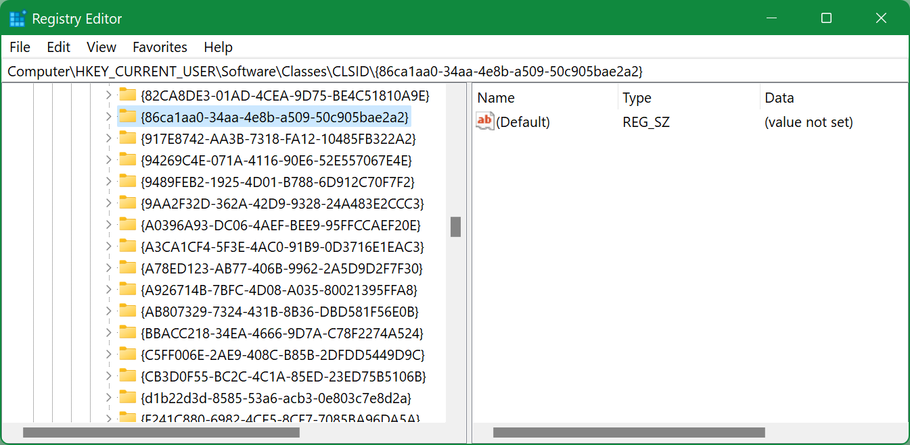
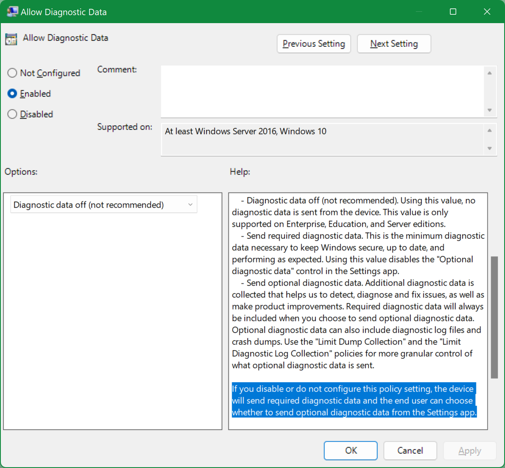

## Windows

<!-- MarkdownTOC -->

- [Information](#information)
    - [System version](#system-version)
    - [Motherboard](#motherboard)
- [System tools](#system-tools)
- [Reboot or shutdown](#reboot-or-shutdown)
- [Chocolatey](#chocolatey)
- [Disks](#disks)
    - [Get information about disks](#get-information-about-disks)
    - [Get disk allocation unit size](#get-disk-allocation-unit-size)
    - [Format disk](#format-disk)
- [Set an environment variable to run an application](#set-an-environment-variable-to-run-an-application)
- [Convert several PNG to ICO](#convert-several-png-to-ico)
- [Date and time](#date-and-time)
- [Replace slashes in path](#replace-slashes-in-path)
- [Files and folders](#files-and-folders)
    - [File checksum](#file-checksum)
    - [Get the folder size](#get-the-folder-size)
    - [Tree equivalent](#tree-equivalent)
    - [Create a symbolic link](#create-a-symbolic-link)
        - [Move iCloud folder to a different disk](#move-icloud-folder-to-a-different-disk)
- [Extract MSI contents](#extract-msi-contents)
- [Open ports by applications](#open-ports-by-applications)
- [Open console from system account](#open-console-from-system-account)
- [Time an operation](#time-an-operation)
    - [cmd](#cmd)
    - [PowerShell](#powershell)
- [Disable Microsoft Defender Antivirus](#disable-microsoft-defender-antivirus)
- [Disable fucking Xbox Game Bar](#disable-fucking-xbox-game-bar)
- [Windows 11](#windows-11)
    - [Return back normal context menu](#return-back-normal-context-menu)
    - [Show all tray icons](#show-all-tray-icons)
- [Installing H.265/HEVC](#installing-h265hevc)
- [Moving WSL distribution to a different drive](#moving-wsl-distribution-to-a-different-drive)
- [Extract Windows product/serial key](#extract-windows-productserial-key)
- [Alternative for which](#alternative-for-which)
- [MSVC C++ runtime downloads](#msvc-c-runtime-downloads)
- [Disable CompatTelRunner](#disable-compattelrunner)

<!-- /MarkdownTOC -->

### Information

#### System version

```
> systeminfo | findstr /B /C:"OS Name" /C:"OS Version"
Microsoft Windows 10 Enterprise
OS Version: 10.0.19043 N/A Build 19043
```

#### Motherboard

```
> wmic baseboard get product,manufacturer,version,serialnumber
```

### System tools

System information:

``` cmd
> msinfo32.exe
```

Device Manager:

``` cmd
> devmgmt.msc
```

Shared Folders:

``` cmd
> fsmgmt.msc
```

### Reboot or shutdown

``` cmd
> shutdown /s /t 3600 /c "Because of reasons"
```

here:

- `/s` - operation
    + `/s` - shutdown
    + `/r` - reboot
    + `/h` - hybernate (*requires also `/f`*)
- `/t` - timeout, after how many seconds
- `/c` - comment

### Chocolatey

[Chocolatey](https://chocolatey.org) is a package manager like [APT](https://wiki.debian.org/Apt) or [Homebrew](https://brew.sh).

View installed packages:

```
choco list --localonly
```

Install something:

```
choco install rclone
```

Uninstall something:

```
choco uninstall rclone
```

Update everything:

```
choco upgrade all
```

### Disks

#### Get information about disks

``` bash
$ wmic diskdrive get caption, serialnumber, mediatype, size, model, bytespersector

BytesPerSector  Caption                                   MediaType                 Model                                     SerialNumber          Size
512             ST2000DX002-2DV164                        Fixed hard disk media     ST2000DX002-2DV164                        Z7ZVL719              2000396321280
512             Samsung SSD 970 EVO 1TB                   Fixed hard disk media     Samsung SSD 970 EVO 1TB                   0025_4351_91N3_2EX2.  1000202273280
512             Samsung Portable SSD T5 SCSI Disk Device  External hard disk media  Samsung Portable SSD T5 SCSI Disk Device  6DM8B7394321          41126400
512             Seagate Ultra Slim GD SCSI Disk Device    External hard disk media  Seagate Ultra Slim GD SCSI Disk Device    BA9G03V9              1000202273280
512             Samsung Portable SSD T5 SCSI Disk Device  External hard disk media  Samsung Portable SSD T5 SCSI Disk Device  9Q18N7620321          1000202273280
```

Don't let this `512` of `BytesPerSector` confuse you - this is not the allocation unit size but the standard physical sector size.

#### Get disk allocation unit size

Open `cmd` as Administrator:

``` bash
> diskpart

DISKPART> list volume

  Volume ###  Ltr  Label        Fs     Type        Size     Status     Info
  ----------  ---  -----------  -----  ----------  -------  ---------  --------
  Volume 0     D   data         NTFS   Partition   1863 GB  Healthy
  Volume 1         Recovery     NTFS   Partition    499 MB  Healthy
  Volume 2     C   system       NTFS   Partition    299 GB  Healthy    Boot
  Volume 3     E   work         NTFS   Partition    400 GB  Healthy
  Volume 4                      FAT32  Partition     99 MB  Healthy    System
  Volume 5     F   Samsung_T5   exFAT  Partition   1863 GB  Healthy

DISKPART> select volume 5

Volume 5 is the selected volume.

DISKPART> filesystem

Current File System

  Type                 : exFAT
  Allocation Unit Size : 128K
```

#### Format disk

Open `cmd` as Administrator:

```
> diskpart

list disk
select disk 2
clean
create partition primary
select partition 1
active
format fs=NTFS quick
assign letter=Z
```

On Windows XP `diskpart` won't see you disk, so you have to install **Hitachi Microdrive** drivers. It also doesn't have the `format` command, so you need to do it with a standard formatter after assigning a letter to the disk (exit `diskpart` and format the disk).

You can format the other filesystems and with specific allocation unit, for example to exFAT with 16 KB AU:

```
format fs=exfat label="some" unit=16K quick
filesystem
```

If you want your disk to mount on Mac OS as well, select 1024K AU:

```
format fs=exfat label="some" unit=1024K quick
```

...but be aware that if you'll store a lot of small files on that disk with 1024K AU, then the performance (*and disk space utilization*) will be very bad.

### Set an environment variable to run an application

For example, some idiots didn't think about High DPI displays, when they were developing a Qt-based application. So you can fix that by setting the variable before launching the application:

```
cmd /c "set QT_AUTO_SCREEN_SCALE_FACTOR=1 & some-qt-app.exe"
```

### Convert several PNG to ICO

Install [ImageMagick](https://imagemagick.org/) and:

```
magick convert *.png app.ico
```

### Date and time

Current date:

```
> echo %date%
```

Current time:

```
> echo %time%
```

Current timezone:

```
> tzutil /g
```

Everything together:

```
> echo %date% %time% & tzutil /g
```

Also, depending on the locale, you can query those variables as follows:

```
set year=%date:~10,4%
set month=%date:~4,2%
set day=%date:~7,2%
```

### Replace slashes in path

Suppose you want to use `%system.teamcity.build.workingDir%` variable in TeamCity, but your build agent is running on Windows and you need to pass this path to CMake. Here's how you can replace the back slashes with forward slashes (note the double `%%` to escape Windows variables from TeamCity variables):

```
SET bspath=%system.teamcity.build.workingDir%/ololo/something
SET fspath=%%bspath:\=/%%

cmake.exe -D some_dir=%%fspath%%
```

### Files and folders

#### File checksum

```
> CertUtil -hashfile some-file.mp4 SHA1
SHA1 hash of some-file.mp4:
0a49cc1f90270445f32e13ee317444d50e8562bb
CertUtil: -hashfile command completed successfully.
```

#### Get the folder size

Using PowerShell:

```
> Get-ChildItem -Recurse 'd:/temp/some' | Measure-Object -Property Length -Sum


Count    : 23771
Average  :
Sum      : 15117560416
Maximum  :
Minimum  :
Property : Length
```

The size only (*that's in bytes, by the way*):

```
> (Get-ChildItem -Recurse 'd:/temp/some' | Measure-Object -Property Length -Sum).Sum
15117560416
```

You can also call this from cmd:

```
> powershell -c "(Get-ChildItem -Recurse 'd:/temp/some' | Measure-Object -Property Length -Sum).Sum"
```

#### Tree equivalent

Using Python package [seedir](https://github.com/earnestt1234/seedir):

``` sh
$ pip install seedir
```

And then:

``` sh
$ cd /path/of/interest
$ python
>>> import seedir as sd
>>> sd.seedir(".", style="lines", depthlimit=4, first="folders")
>>> exit()
```

or inline:

``` sh
$ cd /path/of/interest
$ python -c 'from seedir import seedir; seedir(".", style="lines", depthlimit=4, first="folders")'
```

#### Create a symbolic link

```
c:\www\datasets>mklink /D link-name n:\some\path\to\some\folder
symbolic link created for link-name <<===>> n:\some\path\to\some\folder

c:\www\datasets>dir
 Volume in drive C has no label.
 Volume Serial Number is 5213-B719

 Directory of c:\www\datasets

08/04/2020  14:12    <DIR>          .
08/04/2020  14:12    <DIR>          ..
08/04/2020  14:12    <SYMLINKD>     link-name [n:\some\path\to\some\folder]
               0 File(s)              0 bytes
               3 Dir(s)  169,287,565,312 bytes free
```

##### Move iCloud folder to a different disk

Before installing/activating iCloud Drive, create a symlink for `c:\Users\YOUR-NAME\iCloudDrive` on a disk/path where you'd like it to be:

``` sh
> cmd /c mklink /J "c:\Users\YOUR-NAME\iCloudDrive" "d:\icloud"
Junction created for c:\Users\YOUR-NAME\iCloudDrive <<===>> d:\icloud
```

Then install/activate iCloud Drive. If you already have it enabled, then disable it, move/delete already synced files, restart iCloud and activate iCloud Drive again.

### Extract MSI contents

Or rather perform a silent install. For example, Python 2:

```
> msiexec /a python-2.7.18.amd64.msi /qb TARGETDIR=D:\programs\python2
```

This should be executed from `cmd`.

### Open ports by applications

In `cmd` as Administrator:

```
> netstat -abn
```

### Open console from system account

Download <http://download.sysinternals.com/files/PSTools.zip>, open `cmd` as Administrator, launch:

```
> psexec -i -s cmd.exe
```

### Time an operation

#### cmd

``` cmd
> time < nul & cmake --build . & time < nul
```

The `&` is important, it should not be `;` or `&&`.

If you'll try to use `echo %time%`, you'll see that it outputs the same moment of time when the entire pipe was executed, which doesn't serve the purpose.

If you need to time an operation that prints a lot to stdout, so it's difficult to scroll back to see the time value, you can print times to file:

``` cmd
> time < nul > time.log & cmake --build . & time < nul >> time.log
```

And instead of feeding `nul` to the prompt, you can use `/t` argument:

``` cmd
> time /t > time.log & cmake --build . & time /t >> time.log
```

#### PowerShell

```
> Measure-Command { (Get-ChildItem -Recurse 'D:/temp/some' | Measure-Object -Property Length -Sum).Sum | Out-Default }
15117560416


Days              : 0
Hours             : 0
Minutes           : 0
Seconds           : 0
Milliseconds      : 695
Ticks             : 6954399
TotalDays         : 8,04907291666667E-06
TotalHours        : 0,00019317775
TotalMinutes      : 0,011590665
TotalSeconds      : 0,6954399
TotalMilliseconds : 695,4399
```

Or if you want only one metric and without the timed command's output:

```
> (Measure-Command { (Get-ChildItem -Recurse 'D:/temp/some' | Measure-Object -Property Length -Sum).Sum }).Milliseconds
695
```

### Disable Microsoft Defender Antivirus

Real-time protection:

1. Launch `gpedit.msc` as Administrator;
2. Open `Computer Configuration` > `Administrative Templates` > `Windows Components` > `Microsoft Defender Antivirus` > `Real-time Protection`;
3. Set `Turn off real-time protection` to Enabled.

And/or the whole thing:

1. Launch `gpedit.msc` as Administrator;
2. Open `Computer Configuration` > `Administrative Templates` > `Windows Components` > `Microsoft Defender Antivirus`;
3. Set `Turn off Microsoft Defender Antivirus` to Enabled.

After reboot it might give you a "severe" warning about some tampering, that "someone" disabled some important Defender settings. You know what to do with that warning.

### Disable fucking Xbox Game Bar

These fucking choose application popups on start of every game, apparently it wants to be ready to record the screen, but nobody wants it to. Either try to disable it via `regedit`:

```
HKEY_CURRENT_USER\SOFTWARE\Microsoft\Windows\CurrentVersion\GameDVR\AppCaptureEnabled # might need to change its type to Decimal
```

and:

```
HKEY_CURRENT_USER\System\GameConfigStore\GameDVR_Enabled 
```

Or uninstall via PowerShell as Administrator:

```
> Get-AppxPackage Microsoft.XboxGamingOverlay | Remove-AppxPackage
```

Either of these should work.

### Windows 11

#### Return back normal context menu

1. Launch `regedit`;
2. Find `HKEY_CURRENT_USER\SOFTWARE\CLASSES\CLSID\`;
3. Create new key `{86ca1aa0-34aa-4e8b-a509-50c905bae2a2}`;
4. In that key create new key `InprocServer32`;
5. In that key open `(Default)` and set it to an empty value, instead of `(value not set)`;
6. Restart the system.



#### Show all tray icons

<https://superuser.com/questions/1680130/windows-11-taskbar-corner-overflow-show-all-tray-icons>

Execute `explorer shell:::{05d7b0f4-2121-4eff-bf6b-ed3f69b894d9}`.

If `Always show all icons` is disabled/non-responsive, launch `regedit`, find `[HKEY_CURRENT_USER\SOFTWARE\Microsoft\Windows\CurrentVersion\Explorer]` and set `EnableAutoTray` to `1`.

### Installing H.265/HEVC

`Win + R` and `ms-windows-store://pdp/?ProductId=9n4wgh0z6vhq`.

### Moving WSL distribution to a different drive

From Git BASH:

``` sh
$ wsl --shutdown

$ wsl --list
Windows Subsystem for Linux Distributions:
Ubuntu (Default)

$ wsl --export Ubuntu /d/temp/ubuntu.tar
Export in progress, this may take a few minutes.
The operation completed successfully.

$ wsl --unregister Ubuntu
Unregistering.
The operation completed successfully.

$ wsl --import Ubuntu /e/wsl/ /d/temp/ubuntu.tar
Import in progress, this may take a few minutes.
The operation completed successfully.

$ ls -L1 /e/wsl/
ext4.vhdx

$ du -hs /e/wsl/
12G     /e/wsl/

$ wsl
```

### Extract Windows product/serial key

<https://answers.microsoft.com/en-us/windows/forum/all/how-to-recover-your-windows-product-key/8687ef5d-4d32-41fc-9310-158f8e5f02e3>

Create a `productkey.vbs` file:

``` vb
Set WshShell = CreateObject("WScript.Shell")
MsgBox ConvertToKey(WshShell.RegRead("HKLM\SOFTWARE\Microsoft\Windows NT\CurrentVersion\DigitalProductId"))

Function ConvertToKey(Key)
Const KeyOffset = 52
i = 28
Chars = "BCDFGHJKMPQRTVWXY2346789"
Do
Cur = 0
x = 14
Do
Cur = Cur * 256
Cur = Key(x + KeyOffset) + Cur
Key(x + KeyOffset) = (Cur \ 24) And 255
Cur = Cur Mod 24
x = x -1
Loop While x >= 0
i = i -1
KeyOutput = Mid(Chars, Cur + 1, 1) & KeyOutput
If (((29 - i) Mod 6) = 0) And (i <> -1) Then
i = i -1
KeyOutput = "-" & KeyOutput
End If
Loop While i >= 0
ConvertToKey = KeyOutput
End Function
```

Double-click, it will open a message box with the key value.

### Alternative for which

``` cmd
> where python
d:\programs\python\python.exe
```

or:

``` cmd
> for %i in (python.exe) do @echo.%~$PATH:i
d:\programs\python\python.exe
```

### MSVC C++ runtime downloads

All the versions: <https://learn.microsoft.com/en-US/cpp/windows/latest-supported-vc-redist>

### Disable CompatTelRunner

<https://superuser.com/a/1660956/682702>

The fucking CompatTelRunner launches at random times and devours 100% of CPU. To disable it, launch `gpedit.msc` and find `Computer Configuration` → `Administrative Templates` → `Windows Components` → `Data Collection and Preview Builds`. There you should see either `Allow Telemetry` (*which you can just set to `Disable`*) or `Allow Diagnostic Data`. If it's the latter, then counter-intuitively you need to set it to `Enabled` and choose `Diagnostic data off (not recommended)` option:



Alternatively(?) you can launch registry editor, find:

```
HKEY_LOCAL_MACHINE\SOFTWARE\Policies\Microsoft\Windows\DataCollection
```

create (*if it doesn't exist yet*) a new `DWORD (32-bit) Value` and set it to `0`.
