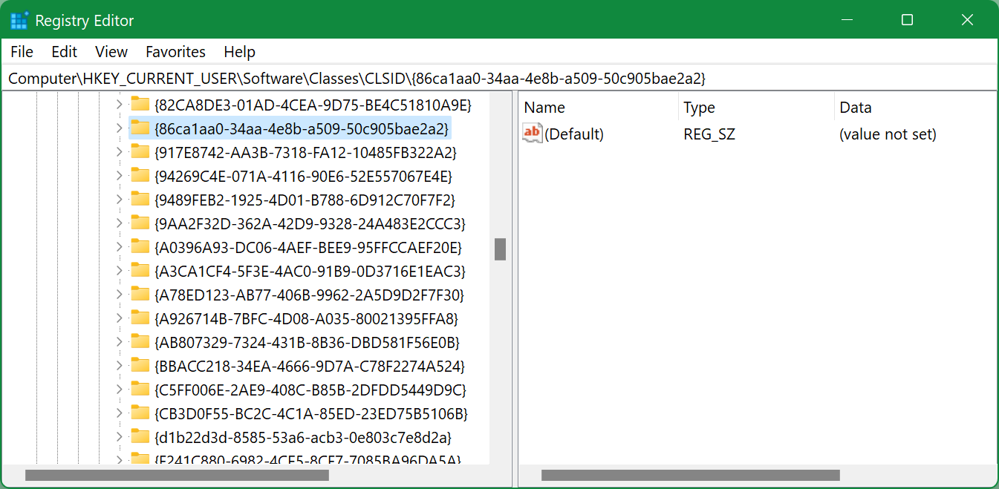

## Windows

<!-- MarkdownTOC -->

- [Information](#information)
    - [System version](#system-version)
    - [Motherboard](#motherboard)
- [System tools](#system-tools)
- [Reboot or shutdown](#reboot-or-shutdown)
- [Chocolatey](#chocolatey)
- [Disks](#disks)
    - [Get information about disks](#get-information-about-disks)
    - [Get disk allocation unit size](#get-disk-allocation-unit-size)
    - [Format disk](#format-disk)
- [Set an environment variable to run an application](#set-an-environment-variable-to-run-an-application)
- [Convert several PNG to ICO](#convert-several-png-to-ico)
- [Date and time](#date-and-time)
- [Replace slashes in path](#replace-slashes-in-path)
- [Create a symbolic link](#create-a-symbolic-link)
    - [Move iCloud folder to a different disk](#move-icloud-folder-to-a-different-disk)
- [Get the folder size](#get-the-folder-size)
- [Time the operation](#time-the-operation)
- [Extract MSI contents](#extract-msi-contents)
- [Open ports by applications](#open-ports-by-applications)
- [File checksum](#file-checksum)
- [Open console from system account](#open-console-from-system-account)
- [Time an operation in cmd](#time-an-operation-in-cmd)
- [Disable Microsoft Defender Antivirus](#disable-microsoft-defender-antivirus)
- [Return back normal context menu in Windows 11](#return-back-normal-context-menu-in-windows-11)
- [Show all tray icons in Windows 11](#show-all-tray-icons-in-windows-11)

<!-- /MarkdownTOC -->

### Information

#### System version

```
> systeminfo | findstr /B /C:"OS Name" /C:"OS Version"
Microsoft Windows 10 Enterprise
OS Version: 10.0.19043 N/A Build 19043
```

#### Motherboard

```
> wmic baseboard get product,manufacturer,version,serialnumber
```

### System tools

System information:

``` cmd
> msinfo32.exe
```

Device Manager:

``` cmd
> devmgmt.msc
```

Shared Folders:

``` cmd
> fsmgmt.msc
```

### Reboot or shutdown

``` cmd
> shutdown /s /t 3600 /c "Because of reasons"
```

here:

- `/s` - operation
    + `/s` - shutdown
    + `/r` - reboot
    + `/h` - hybernate (*requires also `/f`*)
- `/t` - timeout, after how many seconds
- `/c` - comment

### Chocolatey

[Chocolatey](https://chocolatey.org) is a package manager like [APT](https://wiki.debian.org/Apt) or [Homebrew](https://brew.sh).

View installed packages:

```
choco list --localonly
```

Install something:

```
choco install rclone
```

Uninstall something:

```
choco uninstall rclone
```

Update everything:

```
choco upgrade all
```

### Disks

#### Get information about disks

``` bash
$ wmic diskdrive get caption, serialnumber, mediatype, size, model, bytespersector

BytesPerSector  Caption                                   MediaType                 Model                                     SerialNumber          Size
512             ST2000DX002-2DV164                        Fixed hard disk media     ST2000DX002-2DV164                        Z7ZVL719              2000396321280
512             Samsung SSD 970 EVO 1TB                   Fixed hard disk media     Samsung SSD 970 EVO 1TB                   0025_4351_91N3_2EX2.  1000202273280
512             Samsung Portable SSD T5 SCSI Disk Device  External hard disk media  Samsung Portable SSD T5 SCSI Disk Device  6DM8B7394321          41126400
512             Seagate Ultra Slim GD SCSI Disk Device    External hard disk media  Seagate Ultra Slim GD SCSI Disk Device    BA9G03V9              1000202273280
512             Samsung Portable SSD T5 SCSI Disk Device  External hard disk media  Samsung Portable SSD T5 SCSI Disk Device  9Q18N7620321          1000202273280
```

Don't let this `512` of `BytesPerSector` confuse you - this is not the allocation unit size but the standard physical sector size.

#### Get disk allocation unit size

Open `cmd` as Administrator:

``` bash
> diskpart

DISKPART> list volume

  Volume ###  Ltr  Label        Fs     Type        Size     Status     Info
  ----------  ---  -----------  -----  ----------  -------  ---------  --------
  Volume 0     D   data         NTFS   Partition   1863 GB  Healthy
  Volume 1         Recovery     NTFS   Partition    499 MB  Healthy
  Volume 2     C   system       NTFS   Partition    299 GB  Healthy    Boot
  Volume 3     E   work         NTFS   Partition    400 GB  Healthy
  Volume 4                      FAT32  Partition     99 MB  Healthy    System
  Volume 5     F   Samsung_T5   exFAT  Partition   1863 GB  Healthy

DISKPART> select volume 5

Volume 5 is the selected volume.

DISKPART> filesystem

Current File System

  Type                 : exFAT
  Allocation Unit Size : 128K
```

#### Format disk

Open `cmd` as Administrator:

```
> diskpart

list disk
select disk 2
clean
create partition primary
select partition 1
active
format fs=NTFS quick
assign letter=Z
```

On Windows XP `diskpart` won't see you disk, so you have to install **Hitachi Microdrive** drivers. It also doesn't have the `format` command, so you need to do it with a standard formatter after assigning a letter to the disk (exit `diskpart` and format the disk).

You can format the other filesystems and with specific allocation unit, for example to exFAT with 16 KB AU:

```
format fs=exfat label="some" unit=16K quick
filesystem
```

If you want your disk to mount on Mac OS as well, select 1024K AU:

```
format fs=exfat label="some" unit=1024K quick
```

### Set an environment variable to run an application

For example, some idiots didn't think about High DPI displays, when they were developing a Qt-based application. So you can fix that by setting the variable before launching the application:

```
cmd /c "set QT_AUTO_SCREEN_SCALE_FACTOR=1 & some-qt-app.exe"
```

### Convert several PNG to ICO

Install [ImageMagick](https://imagemagick.org/) and:

```
magick convert *.png app.ico
```

### Date and time

Current date:

```
> echo %date%
```

Current time:

```
> echo %time%
```

Current timezone:

```
> tzutil /g
```

Everything together:

```
> echo %date% %time% & tzutil /g
```

Also, depending on the locale, you can query those variables as follows:

```
set year=%date:~10,4%
set month=%date:~4,2%
set day=%date:~7,2%
```

### Replace slashes in path

Suppose you want to use `%system.teamcity.build.workingDir%` variable in TeamCity, but your build agent is running on Windows and you need to pass this path to CMake. Here's how you can replace the back slashes with forward slashes (note the double `%%` to escape Windows variables from TeamCity variables):

```
SET bspath=%system.teamcity.build.workingDir%/ololo/something
SET fspath=%%bspath:\=/%%

cmake.exe -D some_dir=%%fspath%%
```

### Create a symbolic link

```
c:\www\datasets>mklink /D link-name n:\some\path\to\some\folder
symbolic link created for link-name <<===>> n:\some\path\to\some\folder

c:\www\datasets>dir
 Volume in drive C has no label.
 Volume Serial Number is 5213-B719

 Directory of c:\www\datasets

08/04/2020  14:12    <DIR>          .
08/04/2020  14:12    <DIR>          ..
08/04/2020  14:12    <SYMLINKD>     link-name [n:\some\path\to\some\folder]
               0 File(s)              0 bytes
               3 Dir(s)  169,287,565,312 bytes free
```

#### Move iCloud folder to a different disk

Before installing/activating iCloud Drive, create a symlink for `c:\Users\YOUR-NAME\iCloudDrive` on a disk/path where you'd like it to be:

``` sh
> cmd /c mklink /J "c:\Users\YOUR-NAME\iCloudDrive" "d:\icloud"
Junction created for c:\Users\YOUR-NAME\iCloudDrive <<===>> d:\icloud
```

Then install/activate iCloud Drive. If you already have it enabled, then disable it, move/delete already synced files, restart iCloud and activate iCloud Drive again.

### Get the folder size

Using PowerShell:

```
> Get-ChildItem -Recurse 'd:/temp/some' | Measure-Object -Property Length -Sum


Count    : 23771
Average  :
Sum      : 15117560416
Maximum  :
Minimum  :
Property : Length
```

The size only (*that's in bytes, by the way*):

```
> (Get-ChildItem -Recurse 'd:/temp/some' | Measure-Object -Property Length -Sum).Sum
15117560416
```

You can also call this from cmd:

```
> powershell -c "(Get-ChildItem -Recurse 'd:/temp/some' | Measure-Object -Property Length -Sum).Sum"
```

### Time the operation

In PowerShell:

```
> Measure-Command { (Get-ChildItem -Recurse 'D:/temp/some' | Measure-Object -Property Length -Sum).Sum | Out-Default }
15117560416


Days              : 0
Hours             : 0
Minutes           : 0
Seconds           : 0
Milliseconds      : 695
Ticks             : 6954399
TotalDays         : 8,04907291666667E-06
TotalHours        : 0,00019317775
TotalMinutes      : 0,011590665
TotalSeconds      : 0,6954399
TotalMilliseconds : 695,4399
```

Or if you want only one metric and without the timed command's output:

```
> (Measure-Command { (Get-ChildItem -Recurse 'D:/temp/some' | Measure-Object -Property Length -Sum).Sum }).Milliseconds
695
```

### Extract MSI contents

Or rather perform a silent install. For example, Python 2:

```
> msiexec /a python-2.7.18.amd64.msi /qb TARGETDIR=D:\programs\python2
```

This should be executed from `cmd`.

### Open ports by applications

In `cmd` as Administrator:

```
> netstat -abn
```

### File checksum

```
> CertUtil -hashfile some-file.mp4 SHA1
SHA1 hash of some-file.mp4:
0a49cc1f90270445f32e13ee317444d50e8562bb
CertUtil: -hashfile command completed successfully.
```

### Open console from system account

Download <http://download.sysinternals.com/files/PSTools.zip>, open `cmd` as Administrator, launch:

```
> psexec -i -s cmd.exe
```

### Time an operation in cmd

``` cmd
> time < nul & cmake --build . & time < nul
```

Single `&` is important, it should not be double `&&`.

You can also try `echo %time%`, but it outputs the same moment of time when the entire pipe was executed.

### Disable Microsoft Defender Antivirus

Real-time protection:

1. Launch `gpedit.msc` as Administrator;
2. Open `Computer Configuration` > `Administrative Templates` > `Windows Components` > `Microsoft Defender Antivirus` > `Real-time Protection`;
3. Set `Turn off real-time protection` to Enabled.

And/or the whole thing:

1. Launch `gpedit.msc` as Administrator;
2. Open `Computer Configuration` > `Administrative Templates` > `Windows Components` > `Microsoft Defender Antivirus`;
3. Set `Turn off Microsoft Defender Antivirus` to Enabled.

After reboot it might give you a "severe" warning about some tampering, that "someone" disabled some important Defender settings. You know what to do with that warning.

### Return back normal context menu in Windows 11

1. Launch `regedit`;
2. Find `HKEY_CURRENT_USER\SOFTWARE\CLASSES\CLSID\`;
3. Create new key `{86ca1aa0-34aa-4e8b-a509-50c905bae2a2}`;
4. In that key create new key `InprocServer32`;
5. In that key open `(Default)` and set it to an empty value, instead of `(value not set)`;
6. Restart the system.



### Show all tray icons in Windows 11

<https://superuser.com/questions/1680130/windows-11-taskbar-corner-overflow-show-all-tray-icons>

Execute `explorer shell:::{05d7b0f4-2121-4eff-bf6b-ed3f69b894d9}`.

If `Always show all icons` is disabled/non-responsive, launch `regedit`, find `[HKEY_CURRENT_USER\SOFTWARE\Microsoft\Windows\CurrentVersion\Explorer]` and set `EnableAutoTray` to `1`.
