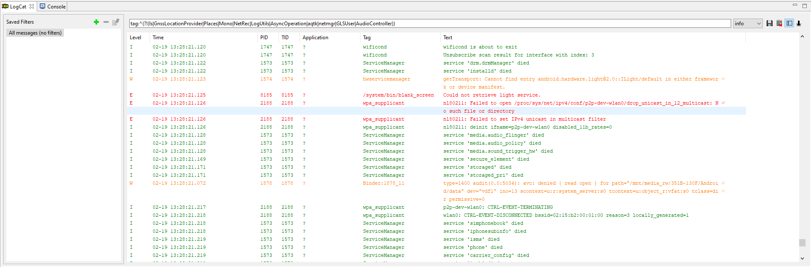

## Android

Mostly Windows and Visual Studio stuff.

<!-- MarkdownTOC -->

- [adb](#adb)
    - [Copy folder to device](#copy-folder-to-device)
    - [List folder contents on device](#list-folder-contents-on-device)
    - [Remove folder from device](#remove-folder-from-device)
    - [Install an application](#install-an-application)
- [LogCat](#logcat)
    - [Android Device Monitor](#android-device-monitor)
    - [CLI](#cli)
- [Emulator](#emulator)
    - [Fails to start from Visual Studio](#fails-to-start-from-visual-studio)
- [Gradle](#gradle)
    - [Build](#build)

<!-- /MarkdownTOC -->

### adb

On Windows for some operations better to run it from `cmd.exe`, not Git BASH.

#### Copy folder to device

``` cmd
e:\tools\android-vs\platform-tools>adb push c:\Users\YOURNAME\Downloads\some-folder /storage/emulated/0
```

#### List folder contents on device

``` cmd
e:\tools\android-vs\platform-tools>adb ls /storage/emulated/0/some-folder
```

#### Remove folder from device

``` cmd
e:\tools\android-vs\platform-tools>adb shell
generic_x86_arm:/ $ rm -r /storage/emulated/0/some-folder
```

#### Install an application

```
$ /e/tools/android-sdk/platform-tools/adb install SomeApplication/build/outputs/apk/release/SomeApplication-release.apk
```

### LogCat

#### Android Device Monitor

Visual Studio allows to launch **Android Device Monitor** application (`Tools` → `Android`). It has LogCat, where you can watch for logs. To filter the log messages, or rather to exclude some noisy sources you can use the following regular expression:

```
tag:^(?!(ls|GnssLocationProvider|Places|Mono|NetRec|LogUtils|AsyncOperation|aqtk|netmgr|GLSUser|AudioController))
```



#### CLI

If you want to show logs only from your application and some other tag:

```
$ /e/tools/android-sdk/platform-tools/adb logcat -s YourApplication -s SomeOtherTag
```

### Emulator

#### Fails to start from Visual Studio

At some point they broke something, so now it requires elevation to Administrator. So you'll need to launch Visual Studio as Administrator too and then start Emulator from there.

### Gradle

#### Build

Build a Release configuration of an application (*run from sources folder, where `gradlew` is*):

```
$ JAVA_HOME=/e/tools/android-studio/jre ./gradlew :SomeApplication:assembleRelease
```
