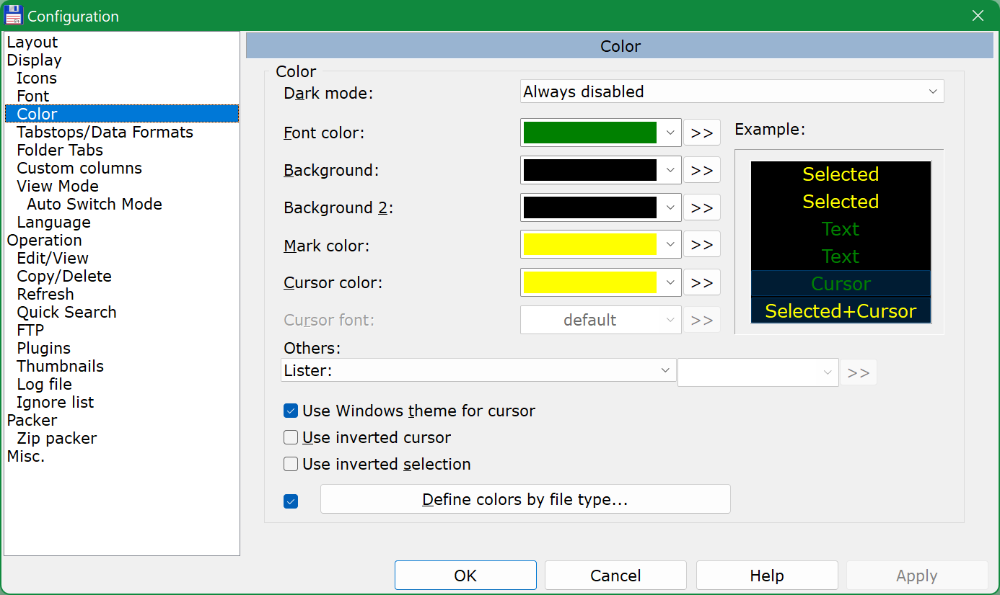
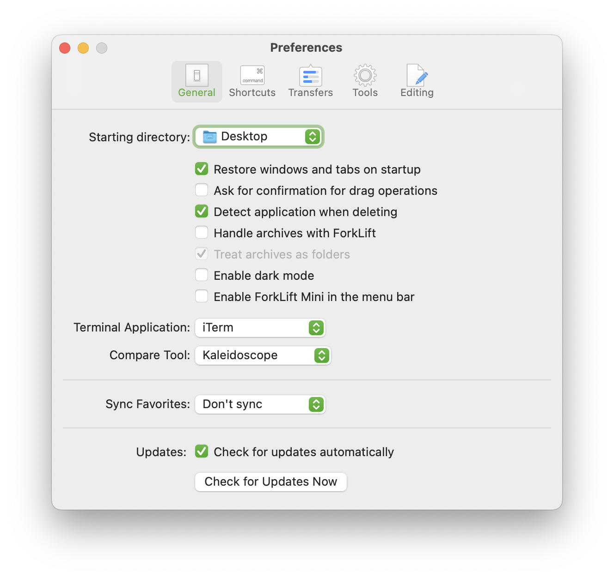
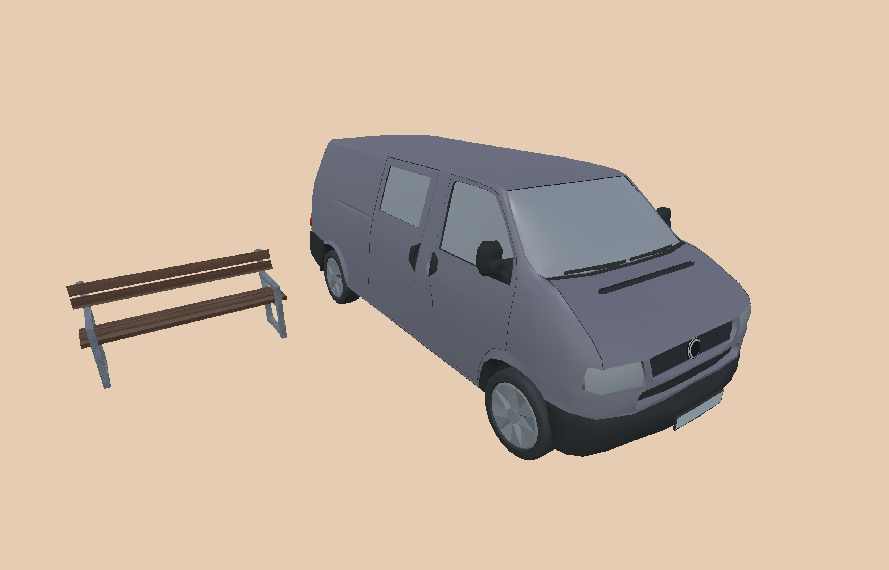
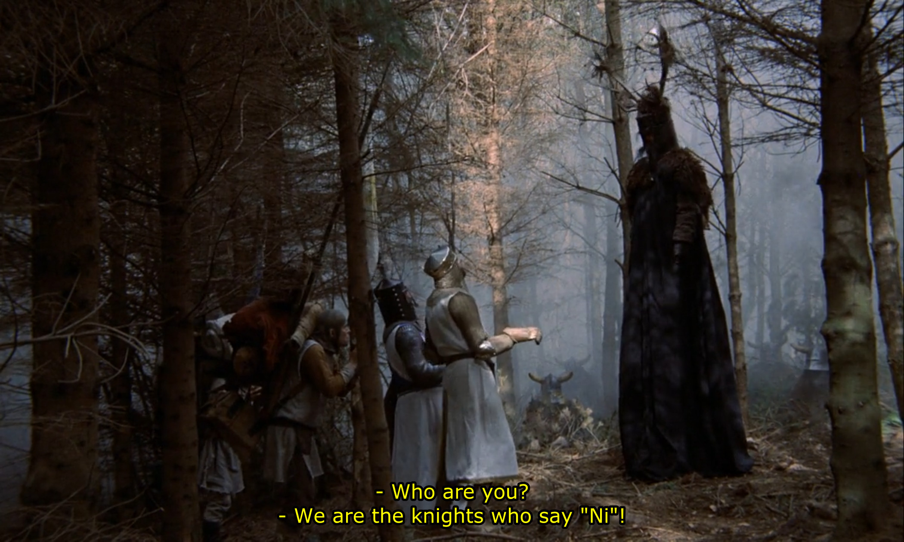
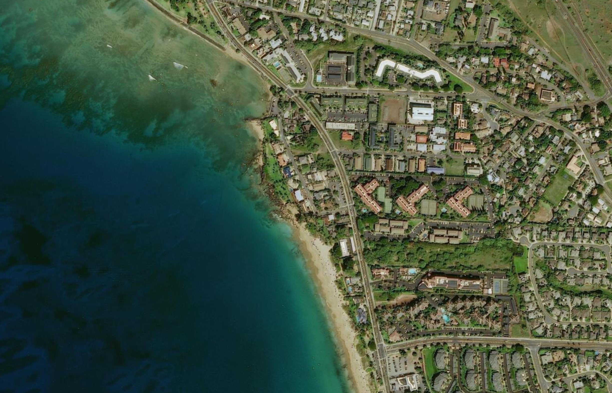

## Making screenshots and screen recording

Before uploading/committing your media assets anywhere for people to see, those files need to be processed/edited/converted in a way that they are optimal in terms of the following criteria:

- reasonable file size and visual quality
- most common/compatible format

Below are specific requirements and guidelines for preparing such media assets.

<!-- MarkdownTOC -->

- [Images](#images)
    - [PNG or JPEG](#png-or-jpeg)
        - [When to choose PNG](#when-to-choose-png)
        - [When to choose JPEG](#when-to-choose-jpeg)
    - [How to make a screenshot](#how-to-make-a-screenshot)
    - [Preparing the image](#preparing-the-image)
        - [Scaling down](#scaling-down)
        - [Redacting irrelevant parts](#redacting-irrelevant-parts)
- [Videos](#videos)
    - [Screen recording](#screen-recording)
        - [With standard system tools](#with-standard-system-tools)
            - [Mac OS](#mac-os)
            - [iOS](#ios)
        - [With OBS Studio](#with-obs-studio)
        - [With FFmpeg](#with-ffmpeg)
    - [Cutting out audio stream](#cutting-out-audio-stream)

<!-- /MarkdownTOC -->

### Images

#### PNG or JPEG

As you know, common formats for images are PNG and JPEG. When you are about to make a screenshot, you'll need to decide, in which format to save it. You probably already know how to choose the right format, but just in case here are some examples.

##### When to choose PNG

- an application GUI:



- something with transparency, such as window shadow effect on Mac OS:



- a "simple" GL scenery with low variety of colors:



Certainly, you can make screenshots for all of these kinds in JPEG too, but the visual quality of those would be considerably worse (*especially those with transparency*).

##### When to choose JPEG

- a video still frame:



- a "complex" GL scenery with high variety of colors:



With the last screenshot as an example - the same screenshot made in PNG would result in 4.3 MB file size, while in JPEG format it's 968 KB with nearly the same visual quality.

#### How to make a screenshot

Different operating systems provide different means for taking screenshots:

- [Mac OS](https://support.apple.com/en-au/guide/mac-help/mh26782/mac):
    - `Cmd + Shift + 3` - entire screen
    - `Cmd + Shift + 4` - selected region
        + if you press `Space` while in this mode, you'll be able to capture a window of your choice
    - or any screenshot application of your choice
- [Windows](https://support.microsoft.com/en-us/windows/keyboard-shortcut-for-print-screen-601210c0-b3a9-7b58-bc40-bae4dcf5f108):
    + `PrtScn` - entire screen
    + `Alt + PrtScn` - active window
    + or any screenshot application of your choice
        * for example, [Greenshot](https://getgreenshot.org/) is a good one with ability to capture selected regions
- GNU/Linux:
    + depends on the desktop environment and pre-installed tools
    + or any screenshot application of your choice
- iOS:
    + [iPhone](https://support.apple.com/en-gb/HT200289)
    + [iPad](https://support.apple.com/en-gb/HT210781)
- [Android](https://support.google.com/android/answer/9075928)

Some general guidelines:

- do not grab the entire screen when you only need to screenshot one window or just a portion of a window:
    + use active window capture functionality
    + or capture a selected region
- do not make screenshots of text content, especially when it's a terminal/console output. It is almost always better to copy the actual text and paste it as text

#### Preparing the image

Once you've taken your screenshot, it might require some final preparations before it's ready for publishing.

##### Scaling down

If your screen has a resolution higher than average (*4K, 8K, etc*), then your screenshots will be too big in size (*unless you do need them to be 4K, 8K, etc*), which often is a wastful overkill, and so you might need to scale them down. There is no specific resolution that we could declare a standard, especially that window/region screenshots can have all sorts of dimensions/ratio, but in general it should be something no more than `1920x1080` in case of fullscreen screenshots. To scale down an image you can use an image editor of your choice or [ImageMagick](https://imagemagick.org/index.php) CLI tool:

``` sh
$ magick identify -format "%[fx:w]x%[fx:h]" ./screenshot-original.jpg
2450x1575
$ du -h ./screenshot-original.jpg
968K

$ magick convert ./screenshot-original.jpg -resize 70% ./screenshot-resized.jpg

$ magick identify -format "%[fx:w]x%[fx:h]" ./screenshot-resized.jpg
1715x1103
$ du -h ./screenshot-resized.jpg
588K
```

##### Redacting irrelevant parts

If the screenshot contains some information that is not relevant for the viewer (*unrelated/sensitive text in some input fields or text labels*), edit it in an image editor of your choice and fill those parts with a solid color (*and maybe also blur them afterwards to make it look a bit nicer*).

### Videos

Aside from the video file size the main criteria is video compatibility across platforms and most importantly web-browsers. In general, video should have the following characteristics:

- format/container: `MP4`
- video-codec: `H.264/libx264`
- chroma subsampling / pixel format: `yuv420p`

To check your video characteristics you can use [FFmpeg](https://ffmpeg.org/):

```
$ ffmpeg -i ./video.mp4
Input #0, mov,mp4,m4a,3gp,3g2,mj2, from './video.mp4':
  ...
  Duration: 00:00:31.13, start: 0.000000, bitrate: 5932 kb/s
  Stream #0:0[0x1](und): Video: h264 (High) (avc1 / 0x31637661), yuv420p(tv, bt709, progressive), 3840x2160 [SAR 1:1 DAR 16:9], 5737 kb/s, 30 fps, 30 tbr, 15360 tbn (default)
    ...
  Stream #0:1[0x2](und): Audio: aac (LC) (mp4a / 0x6134706D), 48000 Hz, stereo, fltp, 192 kb/s (default)
    ...
```

#### Screen recording

##### With standard system tools

###### Mac OS

Mac OS is probably the only operating system that provides excellent [screen recording functionality](https://support.apple.com/en-us/HT208721) out of the box, no additional software required. Just press `Cmd + Shift + 5` and you will be able to record either the entire screen or a selected region.

The only issue is that the output recording file will be in MOV format/container, so you will need to convert it to MP4:

``` sh
$ ffmpeg ./recording.mov ./video.mp4
```

That will also decrease the file size while preserving almost the same video quality.

###### iOS

iOS also has a convenient [default system functionality](https://support.apple.com/en-us/HT207935) for screen recording.

This one does save to MP4, but the chroma subsampling / pixel format will be `yuvj420p`, so if your video will have problems playing in web-browsers, then you'll need to convert it to `yuv420p`:

``` sh
$ ffmpeg ./recording.mp4 -pix_fmt yuv420p ./video.mp4
```

##### With OBS Studio

Using [OBS Studio](https://obsproject.com/) is probably the easiest (*and cross-platform*) way of doing screen recording, and comparing with [FFmpeg's GDI grabbing](#with-ffmpeg) it produces much better results in terms of framerate or how nice and smooth the recoding is.

In short, the whole process is the following:

1. Launch the OBS Studio and set it up:
    + choose that you'll be recording, not streaming
    + it should automatically detect and set hardware acceleration, if it is available
    + set the framerate to `30` (*or `60`, if your recordings are expected to be rather dynamic*)
    + set the output resolution to match your screen resolution (*otherwise it will be downscaled and will likely have considerably worse quality*)
    + in the Output settings select hardware acceleration for `Encoder` and select `mkv` for `
    + optionally change the output path to be on a disk where you have more space
2. In `Sources` pane click on plus button and select `Display Capture`
    + if you will be recording an application with some GL content (*or some fullscreen application, such as game*) then it might be better to choose `Game Capture`
    + if you have more than one display, choose which one will be recorded
3. In `Controls` pane click on `Start Recording` button.

The `mp4` is not good for recording, because should anything happen the whole file will end up being corrupted, while `mkv` will (*hopefully*) handle this gracefully. After recording is done, "repack" the `*.mkv` file to `*.mp4` (*without re-encoding*).

##### With FFmpeg

You can use [FFmpeg](https://ffmpeg.org/) for screen recording, but that will require you to have some knowledge about FFmpeg and its parameters.

The examples below are meant for Windows (*`-f gdigrab`*), but they can also be used on other platforms, as long as those have a suitable capture device (*such as `x11grab` on a GNU/Linux distribution with X11*).

Speaking about Windows, the `-f gdigrab` option has quite a poor performance, so you might want to use a different capture device, for example `-f dshow`, but that will require installing some additional software, so it's probably easier to just go with [OBS Studio](#with-obs-studio).

If you still want to use FFmpeg, first and most common option would be to perform recording without hardware acceleration:

``` sh
$ ffmpeg -f gdigrab -i desktop -c:v libx264 -pix_fmt yuv420p ./recording.mkv
```

But if your computer has NVIDIA GPU, then you can utilize hardware acceleration for better performance:

``` sh
$ ffmpeg -f gdigrab -i desktop -c:v h264_nvenc -pix_fmt yuv420p ./recording.mkv
```

If you have more than one display and want to record only one of them, then you can do so by setting offsets and providing screen's resolution (*by the way, capturing a custom region instead of the entire screen would work the same way*):

``` sh
$ ffmpeg -f gdigrab -offset_x 0 -offset_y 0 -video_size 3840x2160 -i desktop -c:v h264_nvenc -pix_fmt yuv420p ./recording.mkv
```

If you need to capture not the entire screen but just one window, set its title in the `-i` argument, for example:

``` sh
$ ffmpeg -f gdigrab -i title="Firefox Developer Edition" -c:v h264_nvenc -pix_fmt yuv420p ./recording.mkv
```

Once again, after recording is done, "repack" the `*.mkv` file to `*.mp4` (*without re-encoding*).

#### Cutting out audio stream

Your video file should contains an audio stream only if you meant it to, for example if you have some voice-over comments/guidance. Otherwise you should cut the audio stream out, especially if it's just noise from your microphone with you occasionally snuffling here and there.

First check what streams your video has:

``` sh
$ ffmpeg -i ./video-with-audio.mp4
Input #0, mov,mp4,m4a,3gp,3g2,mj2, from './video-with-audio.mp4':
  ...
  Stream #0:0[0x1](und): Video: h264 (High) (avc1 / 0x31637661), yuv420p(tv, bt709, progressive), 3840x2160 [SAR 1:1 DAR 16:9], 5737 kb/s, 30 fps, 30 tbr, 15360 tbn (default)
    ...
  Stream #0:1[0x2](und): Audio: aac (LC) (mp4a / 0x6134706D), 48000 Hz, stereo, fltp, 192 kb/s (default)
    ...
```

So here `0:0` stream is video and `0:1` stream is audio. Now to cut the audio out, execute the following:

``` sh
$ ffmpeg -i ./video-with-audio.mp4 -map 0:0 -c copy ./video.mp4
```

This will also reduce the file size, naturally:

``` sh
$ du -h ./video-with-audio.mp4
23M

$ du -h ./video.mp4
22M
```
